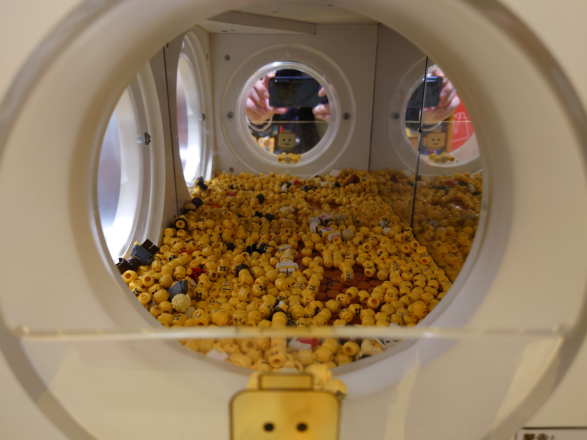
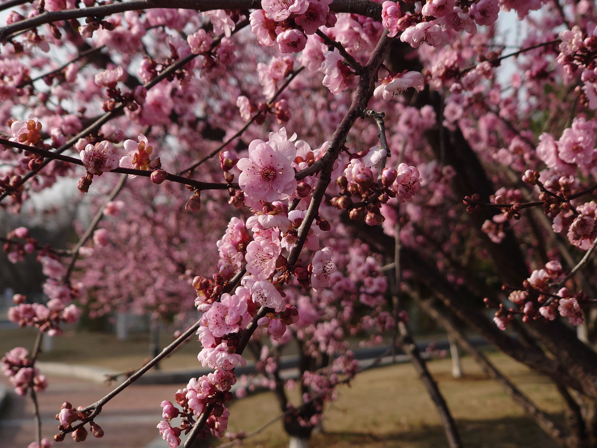
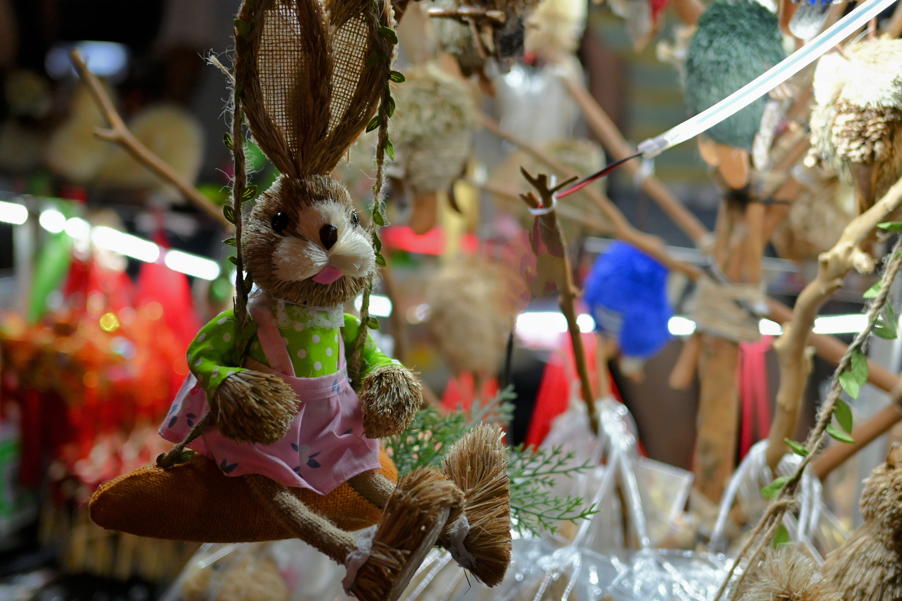
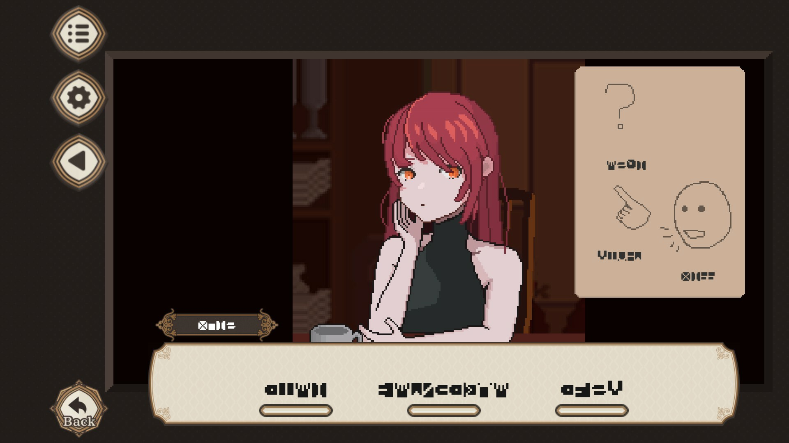
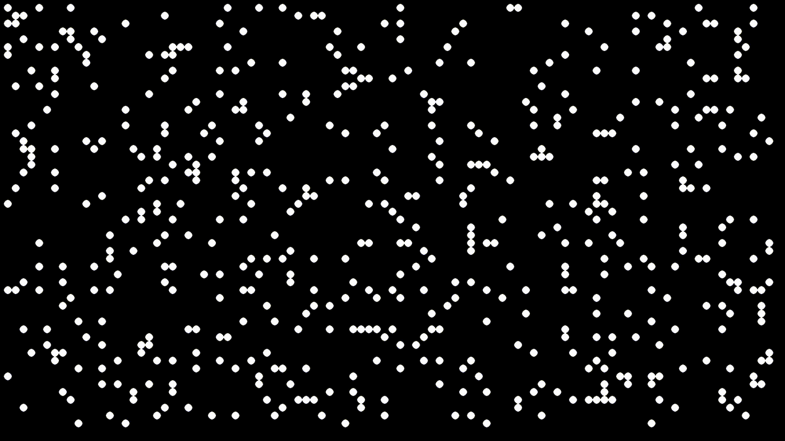

标题的“不务正业”与其说是正事啥也没干，不如说是一个“工作狂魔”蜕变的过程。

年初的时候，我被调去了开源社区，开始为公司的开源项目贡献代码。起初的时候，我还觉得这是一个什么丰功伟绩，要大展宏图了。甚至开始做我负责的deepin-terminal的未来规划了。然而，现实还是挺骨感的。回顾这一年，我好像除了修复代码，填以前开发者留的坑之外，就没有什么别的进展了。**我有时，其实还感到挺失望的。**

也不是说没有高光的时刻吧。比如，做deepin-m1项目的时候，当deepin的logo通过neofetch显示在Mac mini上的时候，我体验到了久违的玩机快乐，仿佛回到了我大二鼓捣树莓派的时光。

不过工作上更多的，还是日复一日的修Bug的枯燥，甚至是你为社区辛勤付出，而大多数社区成员除了发牢骚，甚至开喷deepin, 就没有多少人参与进来，为我们的项目添砖加瓦。以及，明明是开源社区，却要朝九晚五打卡上班。如果没有有意思的问题或者要做的事情，每天上班真的很无聊。

当编程爱好变成了枯燥的工作，无论它以前再怎么令人欣喜，最后也难逃被厌倦的结局。

所以，渐渐地，我发现我有着无尽的热情无处宣泄，量不尽的汗水无处挥洒。我总得找点事做。没错，我大多数时候就是闲不下来的人。

于是乎，今年，我就试着慢下来，“怠慢”下来，不再把工作看得那么重要；和自己对话，看看自己除了编程之外，还会喜欢什么。（就像我疫情被关在家里的时候，半年没写过一行代码的时候类似吧）以下的大多数都应该算是我不务正业的“成果”。

## 年度照片集

> 和朋友在瞎玩时候随便拍的。作品名《拍了个头》。

> 武汉的樱花也不差嘛！

>  好基友结婚了啊。时间过得好快啊。 **(拍糊了有点怨念)**

> 在现实的一寸仙境里荡秋千，~~哪怕我只卖10块钱。~~

> ぼっち・ざ・ろっく !!!＞_＜

 

> 如果我不说的话，你会觉得这是哪里？

> 在外滩和基友去下一个地方玩的路上随手一拍的。国际大都市的街道，果然随手一拍，就很有感觉。

> 流浪狗也会期盼着找到“家”的那一天吗？

> **ある~~春~~の日、俺は“運命”と出逢った**
>
> 一直没有什么兴致去把《路人女主养成方法》这番给补了。结果在遇见她之后，就一口气看完了。

今年年初的时候，我无聊时开始尝试去找点地方瞎拍。拍着拍着，我忽然意识到，我这些年都在用索尼手机，必带实体两段式拍照按键，而且钟爱“手动”挡。或许我是喜欢摄影的。于是乎，年中就买了自己的第一台相机：Nikon Z30. 除前三张是用Sony Xperia 5 II拍的以外，其他的都是这个相机拍的。

## 年度游戏

> 你是否有想过语言的作用？

7 Days to end with you

它是一款真正意义上的文字解密游戏！



你对这个世界的语言一无所知。

 即便如此，还是去试着解读一下眼前这个人所说的话吧。

 就像拼拼图一样，推理出话中每个辞藻的含义。

 按照你的想法，来解读眼前之人所要倾诉的内容。

 你们的关系，由你对这些话语的理解而构成。

 你们的故事，由你对这些话语的理解而谱写。

 你们的世界，视你的理解不同……

 或许会平凡而仓促地收场，又或许会变得奇妙而悠长。

 甚至二者同时发生也不无可能。

 这个故事，是通过你的解读而完整的。

 你所感受到的、解读到的一切，都是正确的。

 哪怕这次无法理解，你也依旧拥有多次尝试的机会。

 这便是发生在7日之间的，短暂而又悠长的故事。	

	

进入游戏之后，玩家面对的便是类似这种完全看不懂的奇怪对话。

为了推进游戏进度同时弄懂对话的含义，玩家可以和场景进行交互，进而获得新的对话内容。然后，游戏的大部分就是在这种解密之中进行着。当然，无论你做什么，七天之后，你都将迎来故事的结局。而获得什么样的结局，完全取决于你最后用来表达的话语。

尽管我现在都还没通关，但我总感觉，就算不理解对话的内容，我还是能感受到，对方并没有恶意，只是单纯地想帮助我，让我想起点什么。多半，背后有着一个温馨治愈的故事吧。

## 年度电影

我知道，谈到今年电影，大多数人肯定会说诺兰的《奥本海默》。我最开始也是这么想的。然而，我又想起来，今年我看过一部被国内观众低估了的动画电影：《[酷爱电影的庞波小姐](https://zh.wikipedia.org/zh-cn/%E9%85%B7%E6%84%9B%E9%9B%BB%E5%BD%B1%E7%9A%84%E9%BE%90%E6%B3%A2%E5%B0%8F%E5%A7%90)》

用一句话来说，它就是献给创作者的一首赞歌。

内向人孤僻，也很不容易融入普通大众，所以他们选择向内探索，并用自己独到的视角去观察这个世界以便能够小心翼翼地存活在这个属于E人的地球（**E**arth)。我们会追求完美，吹毛求疵，就像故事主人公一样，电影镜头拍完之后，剪辑发现需要重拍一些镜头，就算要把演员请回来，再拉投资增加预算，也要把这个电影做到完美的极致。因为，我们除了创作，别无它求：我们无法像E人一样从社交中获取快乐，那样只会大量消耗我们的精力。我们只能全身心扑到自己的一亩三分地当中，去实现梦想，去创造自己觉得，应该诞生于这个世界上的东西。

顺便，创作者都多少有点强迫症。主人公的电影硬要剪到一小时三十分中；而我，视频要整分钟！

## 年度音乐



Toe的[Goodbye](https://music.youtube.com/watch?v=97omRE2flPU)

苦于工作经常性的枯燥无聊，我有时也开始思考起了工作的意义。人，到底是为什么要工作呢？最直接的理由就是，我不工作的话，就没钱生活，而这也是大多数人的答案。然而，有人也不需要工作就可以生活啊。很多老板财务自由了，也还是在指导工作，活跃在企业单位当中。这大概就是工作的另一个作用了：自我实现。

或许许多人也懒得思考吧，就这样混吃等死，干几天玩一天地过下去，从来没想过这些东西。

不知何时起，我意识到地铁上下班的人群，和羊群也没太大区别。有种卓别林的摩登时代开头那段剪辑的意味。人们只是随波逐流，每天的上下班人群，好似被放牧的羊群，何其相似：日出而作，日落而息。



在某一天上班摸鱼听歌的时候，我随机到了这首曲子。首先使它低调含蓄的节奏，一下子就引起了我这个闷骚男的注意。点亮手机屏幕，看到它的封面：纺织车间里一个又一个的纺织机器。然后，我抬头看了一眼我们的工位。绝了，简直一模一样。在工作当中，人们从一个个个性鲜明的独立个体，异化成了统一而无差别的工作机器。这当中，又发生了什么呢？

> There is no one can understand me truly
>
> I do not go out and I will keep silence
>
> Everyone is mania in general
>
> You don't have time to sleep for to know others

 随着年龄的变大，逐渐丧失了对其他人的了解欲望。交友逐渐变成了标签配对，不再愿意耗费时间去了解去磨合。

不过，不得不说，在人群中听效果奇佳无比。你看到身边的人，地铁里的人，刷着哗众取宠的抖音视频，刷着套皮氪金手游，或者看着我初二就已经摸清套路了的无趣网文小说。不得不说，茫茫人海之中，全都是无趣的人，要找寻一些有趣而精彩的朋友，何其困难。

但好像，为了做一些事情，一些面向大众的项目，总还是需要去观察人群。尽管你知道他们何其无趣且机械化，但你总得知道大众在干什么，在关心什么，然后，才能去做影响大众的产品。好像在说胡话，不过，等时机成熟了，我应该会公开这是一个怎么样的东西。

## 年度书籍

《人生脚本》

可能熟悉我的人都知道，我是个前网络喷子。曾经在网上一遍又一遍地和各种B小将，贴吧小将，就着各种话题：华为，数码，Linux什么的，喷来喷去。然而，随着我喷的经验越来越多，我开始意识到，很多人是没有主见的。他们只是为了喷而喷，为了杠你的观点而杠人，归根结底，只是为了发泄情绪，和机器人一样的。就，你回他一句，然后便能想象得到，他之后会怎么回复。然后，还真的大差不差。而且，你永远喷不醒沉睡的人。（甚至他们很玻璃心，被喷了就回完，赶紧拉黑你，生怕看到你的回复内容）

今年，我就发现了这本书，印证了我的想法。其实，我是先看了那本《蛤蟆先生去看心理医生》，然后，就了解到了这一流派的心理学研究：沟通分析。

这本书的基本观点是，一个人的一生总能够找到一个相似的神话故事脚本去匹配，而如果当事人不主动替换脚本的话，也就这么过下去了。（我自己从我的角度去总结的，具体的基础理论假说还有很多，比如说PAC心理状态，心理游戏，心理票据）

就和它的介绍语一样：*说完你好之后，该说什么*。人与人之间的沟通就是靠这样一个游戏脚本似的对话去推进的。不同的人之间，会有不同的对话内容。

而原生家庭，给予了每个人最初的脚本。它顽固到无论你如何费劲力气去挣脱它，去摆脱它，它都能通过各种各样的方式去把你拉回到原本的脚本程序当中。所以，大多数人都不会自讨苦吃，只是随波逐流，照着脚本的内容去过完自己的一生。然而，总有一小部分人，选择了不被这样的脚本去束缚，勇敢地去寻找属于自己的那份“赢家脚本”（指能做到自己想做到的事情），不与其他人玩“游戏”（具体参考《人间游戏》，指人与人之间为收集某种情感，而做的机械式的沟通行为。例如，父母逢年过节在餐桌上指教儿女，获得一种掌握感的行为），内心中清楚自己追寻的东西，面对挑战与挫折能则克服，不能则曲线救国，最终过上自己想要的人生。

**所谓人生脚本，就是一个人如何度过自己一生，如何利用时间的方式。**

## 年度插画

夕末的[《山》](https://www.pixiv.net/en/artworks/106047489)

很巧，这幅画刚好应该是我今年生日时候完成的。我也是今年才发现了这个宝藏画师。上班摸鱼刷推，忽然就刷到了这位。一下就被她的画所吸引了。于是浏览了她的P站账号，随后便发现了这张图。从整体上来说，它所包含的意境瞬间就把我迷住了。JK少女登山登到一半，遥望向远处的夕阳还是什么的，反正不重要。我想的是，画中的主人公一定是在享受登山的过程，登山看到的美景，而不只是达到登到山峰之后的海拔数字，然后打张卡发朋友圈小红书什么的。其实，我喜欢这幅画，也有因为是线性垂直的构图的关系，非常契合我那个狭长的手机屏幕的原因。

很期待这位画师今后的作品。

## 年度程序/动画

因为不务正业，所以除了正事，其他都瞎搞了。而其中，最让我印象深刻的，是前不久弄的pygame的康威生命游戏的2D动画渲染。而pygame是我花了一周，现学现卖用上的。

其实，早在我小学的时候，我就想做动画了。当时，还叫了一大堆朋友到家里，准备搞Flash游戏。然后，我自己还买了一本Flash的书。不过，直到现在了都没翻开过。动画吗？好像也只是说着玩玩，大家打打游戏也就忘记了。

大三时候为了找工作刷题，第一次知道了康威的生命游戏。那是一个周末的清晨，宿舍拉着窗帘，室内很黑。因为舍友还没起床，我就悄悄地去食堂买了最喜欢的玉米吃，然后就回宿舍打开电脑上Leetcode打周赛了。AC了第一道签到题之后，好像第二道就是这个。做的时候，我忽然就被它蕴含的生命话题和它那变换多端的图案给迷住了。想了想，反正我也就是个菜鸡，写完了也拿不到什么名次。所以，我就干脆不做后面的题了，直接开始写Python脚本，把它的图案给可视化出来了。而其中，我最喜欢的图案：Glider.成为了我的Github头像，一直使用至今。

研究生的时候，遭遇新冠疫情，心理出了状况，直接休学了半年。休学的时候就在想，我这学校学的也没啥意思啊，不如找点感兴趣的学学。于是转学到了另一所大学学习互动媒体。第一学期的基础课，互动媒体，我就85+高分通过。



之前，影视飓风在征集《前进》的素材。然而，当我做出来之后，我就意识到了，好像也没必要发过去，毕竟选不不选上都已经无所谓了。因为，这就是我的前进故事，不需要影视飓风的认可，也不需要别人的赞同，只需要我此时此刻发自真心的感动。乔布斯说过，人生连点成线，好像我这些年所做的一切，冥冥之中，有顺带着完成这一儿时的梦想一样。虽然当时的伙伴都已经各奔东西不知道跑哪里去了，但只有这小小的梦想还被好好地埋藏在心里，在今年生根发芽。

哦对了，Glider这个图案有个特点：它会在几个固定图案中循环，然后朝着一个方向前进。或许，这正代表着我所信仰的理念吧。

## 关于2024

说实话，我当时展望2023的时候，立下了一堆计划。最后如你所见的：一个都没做到。:)

所以，我选择躺平，随遇而安吧。但如果看到了什么机会的话，绝对不会想要轻易错过吧。期待2024会发生些啥吧。
