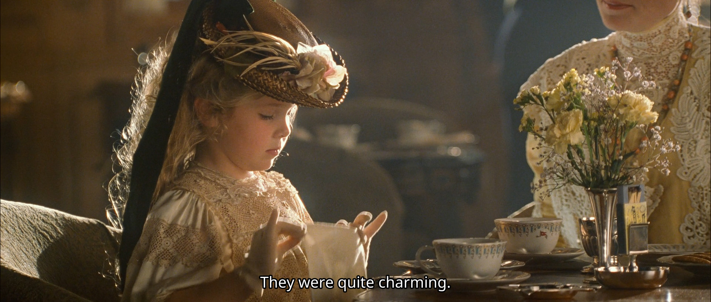

其实，我今年刚开始的时候就看完了泰坦尼克这部电影。不记得以前有没有看过了，没印象了。那就当我这是初次看这部电影吧。当时看过之后，就百感交加，可受困于一直想不到合适的叙述顺序来记录自己的感想，遂久久未能成文。这次决定不能再拖了，于是便分小结，逐一写下我看的时候，产生的各种“化学反应”，大多数是一些，我印象深刻的片段。

## 什么是帅
请原谅我取一个这么逗的小标题，可是，这是我想如何总结这个片段时候，蹦出来的第一个标题。去年碰到了一个想变帅的可爱妹子。我拍摄指导了半天，可惜两人都始终未得要领。这不禁也让我开始思考，怎么定义帅？而当我看到这部电影中，看到小李子演绎的这一段的时候，马上就知道答案了，也想起，多年以前，某人说觉得我很帅，喜欢上我的那一瞬间。（真不是自恋，草）

剧中的Rose评价：He must have been nervous, but he never faltered. 随后，便开始了那段让我印象深刻的名场景。



> Rose她妈(嘲笑的神情): Tell us of the accommodations in steerage, Mr Dawson. I hear they're quite good on this ship
>
> Jack(微笑): The best I've seen, ma'am. Hardly any rats.
>
> (众人大笑)
>
> 家暴男（一本正经）：Mr. Dawson is joining us from the third class. He was of some assistance to my fiancee last night.
>
> Rose: It turns out that Mr. Dawson is quite a fine artist. He was kind enough to show me some of his work today.
>
> 家暴男：Rose and I differ somewhat in our definition of fine art. Not to impugn your work sir.
>
> （Jack 摆手，然后看向Rose, 不知所措。看到端上来的餐具感到迷惑，不知道使用顺序。转向旁边的那啥夫人。）
>
> ...... (随后进入最高潮的名场景)
>
> Rose她妈：And where exactly do you live, Mr. Dawson.
>
> Jack: Well, right now, my address is the RMS Titanic. After that, I'm on God's good humor.
>
> Rose她妈：And how is it you have means to travel.
>
> Jack: I work my way from place to place. You know, tramp steamers and such. But I won my ticket on Titanic here. At a lucky hand at poker. A very luck hand.
>
> 有点胖的绅士：All life is a game of luck.家暴男（不服）：A real man makes his won luck, Archie. Right, Dawson?
>
> Jack: En!
>
> Rose她妈：And you find that sort of rootless existence appealing, do you?
>
> Jack: Oh, yes, ma'am I do. I mean, I've got everything I need right here with me. I got air in my lungs and a few blank sheets of paper. I mean, I love waking up in the morning, not knowing what's gonna happen. Or who I'm gonna meet. Where I'm gonna wind up. Just the other night I was sleeping under a bridge, and now here I am on the grandest ship in the world having champagne with you fine people. (向旁边的服务员要添酒) I'll take some more of that.
>
> I figure life is a gift. And I don't intend on wasting it. You never know what hand you're gonna get dealt next. You learn to take life as it comes at you. 
>
> Here you go, Cal. (丢口香糖) (PS: 原来家暴男叫Cal. 不配有名字的家伙。)
>
> To make each day count.
>
> 众人：Well say, Jack. Yeah, Yeah....
>
> ......

面对满桌的大佬，还有Rose她妈和未婚夫的冷嘲热讽，Jack并没有丝毫自卑，反而用自己的乐观自信折服了在座的所有人。

**所谓的“帅”，大概就是如此。**

## 决定遵从本心

说实话，这一段让我有种当时《爱乐之城》中，石头姐决定离开当前的饭局，前去找高司令的既视感。

或许是看到这里死板迂腐的贵族礼仪和规训，这一幕之后，便是Rose去找杰克，在泰坦尼克号船头，被扶着“展翅高飞”的名场景。

## 你会从这里逃出去的

Jack安慰Rose,给她打气，约定好不要放弃。这也有了下一幕Rose决定活下去，勇敢呼救的，充满极强求生欲的镜头。

## 临终时的床头要摆什么？

Rose不仅做到了像男人一样骑马，还做到了攻读大学学位，开飞机，环游世界等一系列事情。可以说是极其精彩的一生。

*而我临终时的床头，要摆点什么好呢？*

## 愿有情人终成眷属

紧接着临终的那一幕的，便是Rose在最后，与Jack于泰坦尼克号之中相遇。每每看到这一幕，我的泪水都会不由自主地涌出来。

加上上一个画面，这电影的结尾一下子让我哭两次。真强。
