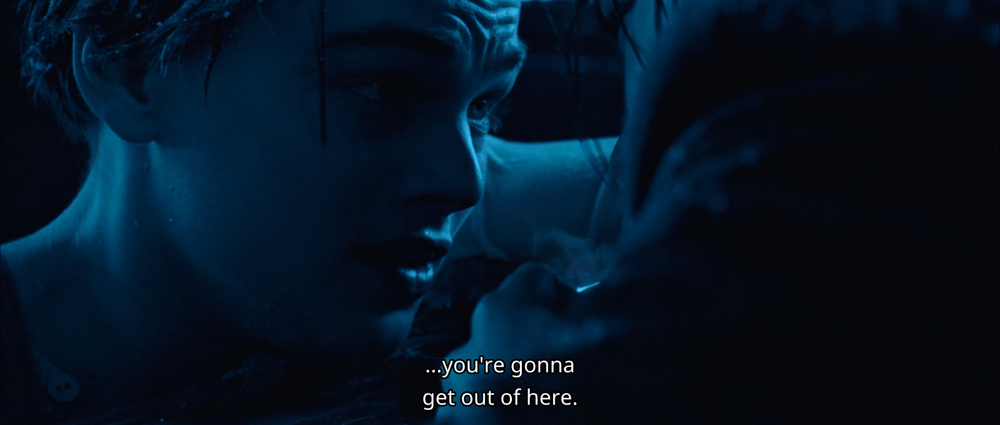
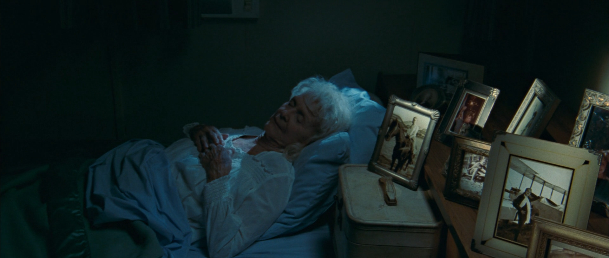
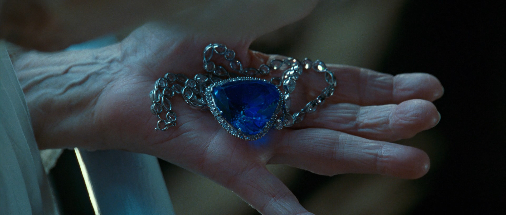

Actually, I watched Titanic earlier this year. I don’t remember if I had seen it before, so let’s assume this was my first time watching the movie. After watching it, I was overwhelmed with emotions, but I couldn't find the right narrative order to express my thoughts, so I didn't write anything for a long time. This time, I decided not to delay any longer. I divided my thoughts into sections and wrote down all the "chemical reactions" I had while watching, focusing on the moments that left a deep impression on me.

## How to define 'Cool'

wwPlease forgive me for giving this section such a playful title, but it was the first thing that came to mind when I thought about summarizing this part. Last year, I met a cute girl who wanted to become "cool." I gave her some photo guidance for a long time, but neither of us really got the hang of it. This made me considering — how do we define "cool"? And when I watched Leonardo DiCaprio's performance in this movie, I immediately knew the answer. It also reminded me of a moment years ago when someone said they thought I was "cool" and fell for me at that instant. (I'm not being narcissistic, I swear! 😅)

In the movie, Rose remarks: "He must have been nervous, but he never faltered." This sets the stage for the memorable scene that follows.



> Rose's Mother (with a mocking expression): Tell us of the accommodations in steerage, Mr. Dawson. I hear they're quite good on this ship.
>
> Jack (smiling): The best I've seen, ma'am. Hardly any rats.
>
> (Everyone laughs)
>
> Cal (serious): Mr. Dawson is joining us from the third class. He was of some assistance to my fiancée last night.
>
> Rose: It turns out that Mr. Dawson is quite a fine artist. He was kind enough to show me some of his work today.
>
> Cal: Rose and I differ somewhat in our definition of fine art. Not to impugn your work, sir.
>
> (Jack gestures dismissively, then looks at Rose, feeling unsure. He glances at the tableware, confused about the order of use, and turns to the lady beside him.)
>
> ... (Then comes the most impressive scene)
>
> Rose's Mother: And where exactly do you live, Mr. Dawson?
> 
> Jack: Well, right now, my address is the RMS Titanic. After that, I'm on God's good humor.
> 
> Rose's Mother: And how is it you have means to travel?
> 
> Jack: I work my way from place to place. You know, tramp steamers and such. But I won my ticket on Titanic here. A lucky hand at poker. A very lucky hand.
> 
> Archie: All life is a game of luck.
> 
> Cal: A real man makes his own luck, Archie. Right, Dawson?
> 
> Jack: En!
> 
> Rose's Mother: And you find that sort of rootless existence appealing, do you?
> 
> Jack: Oh, yes, ma'am, I do. I mean, I've got everything I need right here with me. I got air in my lungs and a few blank sheets of paper. I mean, I love waking up in the morning, not knowing what's gonna happen. Or who I'm gonna meet. Where I'm gonna wind up. Just the other night I was sleeping under a bridge, and now here I am on the grandest ship in the world having champagne with you fine people. (Gestures to the waiter for more wine) I'll take some more of that.
> 
> I figure life is a gift, and I don't intend on wasting it. You never know what hand you're gonna get dealt next. You learn to take life as it comes at you.
> 
> Here you go, Cal. (Throws chewing gum) (PS: Turns out the jerk is named Cal. A guy like him doesn't deserve a name.)
> 
> To make each day count.
> 
> Everyone: Well said, Jack. Yeah, yeah...

Facing a table full of upper-class individuals, along with the sarcastic remarks from Rose's mother and fiancé, Jack didn’t show the slightest hint of inferiority. Instead, he used his optimism and confidence to win over everyone present. # Fixme: phrase check

This, perhaps, is what it means to be truly 'cool'.

## Choosing to Follow One's Heart

To be honest, this scene gave me the same vibe as the moment in "La La Land" when Emma Stone decides to leave the current dinner party to go find Ryan Gosling.

 

Perhaps it was the stiff and old-fashioned aristocratic etiquette and discipline on display here that pushed Rose to seek Jack. What came next was the iconic scene at the bow of the Titanic, where Jack holds her as if she "is flying."

## You Will Get Out of Here

## What Will You Have on Your Bedside Table at the End of Your Life?

*After watching this scene, I couldn’t help but wonder: what will be on my bedside table at the end of my life?*

## May Lovers Eventually Be Together

## One More Thing: The Heart of the Ocean

Before the scene of Rose's death, there's a scene where she throws the "Heart of the Ocean" (a massive blue sapphire) into the sea at the stern of the ship. The entire sequence has no dialogue except for some interjections. The depiction of Rose's inner feelings is restrained and subtle, leaving audiences to wonder what emotions she was feeling as she let go of this treasure which she had kept hidden for most of her life.

At first, I didn’t have a definite thought about this scene. I guessed it was her way of saying goodbye to the past, knowing that her time was almost up. Perhaps the sapphire was one of the few remaining memories of her and Jack left in the world, and by throwing it away, she was giving one last gift to the man who had changed her life and now rested in the ocean.

Then, I saw another version of this scene in the Platinum Edition (cut scene):

In this version, Rose is caught by people on the ship as she's throwing the sapphire. She explains that she had the sapphire in her pocket back then, and just by selling it, she could have lived without difficulties for the rest of her life. However, she didn’t do that and relied on herself instead. Blah blah blah. It seems like everyone felt this version was too preachy, so it wasn't included in the final cut. However, this scene is still very important for understanding Rose's mindset and motivations at that moment.
