其实，我今年刚开始的时候就看完了泰坦尼克这部电影。不记得以前有没有看过了，没印象了。那就当我是初次看这部电影吧。当时看过之后，就百感交加，可受困于一直想不到合适的叙述顺序来记录自己的感想，遂久久未能成文。这次决定不能再拖了，于是便分小结，逐一写下我看的时候，产生的各种“化学反应”，大多数是一些，我印象深刻的片段。

## 什么是帅
请原谅我取一个这么逗的小标题，可是，这是我想如何总结这个片段时候，蹦出来的第一句话。去年碰到了一个想变帅的可爱妹子。我拍摄指导了半天，可惜两人都始终未得要领。这不禁也让我开始思考，怎么定义帅？而当我看到这部电影中，看到小李子演绎的这一段的时候，马上就知道答案了，也想起，多年以前，某人说觉得我很帅，喜欢上我的那一瞬间。（真不是自恋，草）

剧中的Rose评价：“他一定很紧张，但他从未结巴。” 随后，便开始了那段让我印象深刻的名场景。



> 露丝她妈（嘲笑的神情）： 和我们说说三等舱的住宿条件吧，道森先生。我听说这艘船上的三等舱条件相当不错。
>
> 杰克（笑着）： 这是我见过的最好的，夫人。几乎没有老鼠。
>
> （众人哄笑）
>
> 卡尔（一本正经）： 道森先生来自三等舱。他昨晚对我的未婚妻提供了一些帮助。
>
> 露丝： 道森先生实际上是个相当优秀的艺术家。今天他好心地给我看了他的一些作品。
>
> 卡尔： 我们对美术的定义有所不同，并非贬低您的作品，先生。
>
> （杰克摆手，然后看向露丝，有些不知所措。看到端上来的餐具感到迷惑，不知道使用顺序。于是转向旁边的某位夫人。）
>
> ......
>
> （随后进入名场面高潮）
>
> 露丝她妈： 那么，道森先生，你具体住在哪里？
>
> 杰克： 嗯，现在我的地址是RMS泰坦尼克号。之后嘛，就听天由命了。
> 
> 露丝她妈： 那你是怎么有钱旅行的？
> 
> 杰克： 我到处打工。你知道的，搭乘一些杂货轮之类的。不过我赢到了这次泰坦尼克号的船票。在一次幸运的扑克牌局中赢的，非常幸运的一手牌。
> 
> 阿奇： 人生本来就是一场运气的游戏。
> 
> 卡尔（不服）： 真正的男人会自己创造运气，对吧，道森？
> 
> 杰克： 嗯！
> 
> 露丝她妈： 你觉得这种漂泊的生活很有吸引力吗？
> 
> 杰克： 哦，是的，夫人，我觉得很有吸引力。我的意思是，我需要的东西都在这里了。我肺里有空气呼吸，还有几张空白的纸。我喜欢每天早上醒来时，不知道接下来会发生什么，不知道会遇见谁，不知道最后会到哪里去。就像前几天我还睡在桥下，而现在我却在世界上最豪华的船上和你们这些优秀的人一起喝香槟。（向旁边的服务员要添酒）再给我倒点这个。
> 
> 我觉得生命是个礼物，我不打算浪费它。你永远不知道接下来会得到什么牌。你要学会接受生活给你带来的一切。
> 
> 给你，卡尔。（丢口香糖）（PS：原来家暴男叫卡尔。这家伙不配有名字。）
> 
> 让每一天都变得有意义。
> 
> 众人： 说得好，杰克。对，对……
>
> ......

面对满桌的大佬，还有Rose她妈和未婚夫的冷嘲热讽，Jack并没有丝毫自卑，反而用自己的乐观自信折服了在座的所有人。

**所谓的“帅”，大概就是如此。**

## 决定遵从本心

说实话，这一段让我有种当时《爱乐之城》中，石头姐决定离开当前的饭局，前去找高司令的既视感。

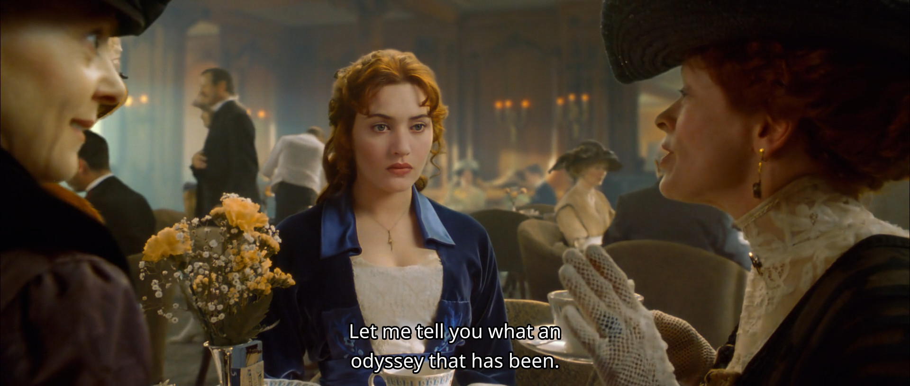

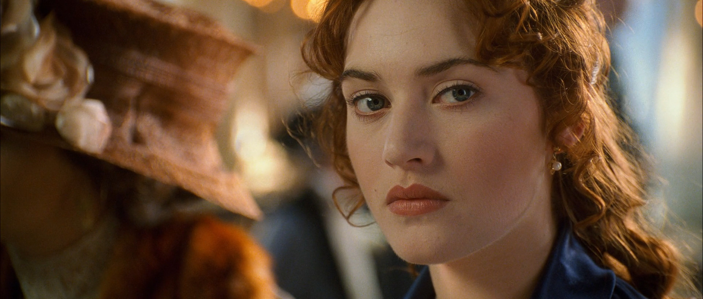

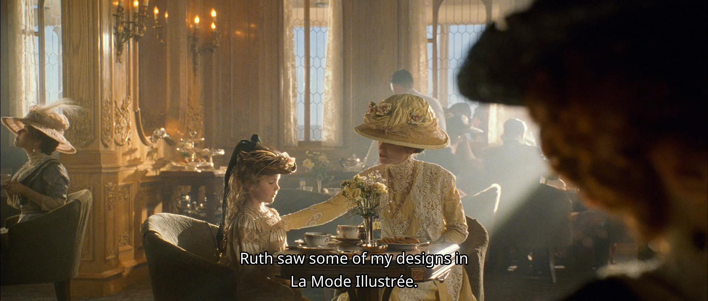

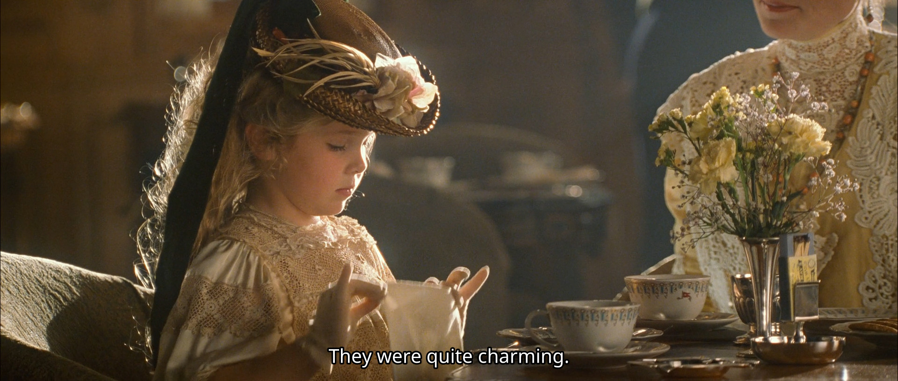

或许是看到这里死板迂腐的贵族礼仪和规训，这一幕之后，便是Rose去找杰克，在泰坦尼克号船头，被扶着“展翅高飞”的名场景。

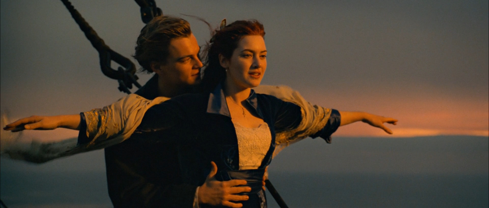

## 你会从这里逃出去的

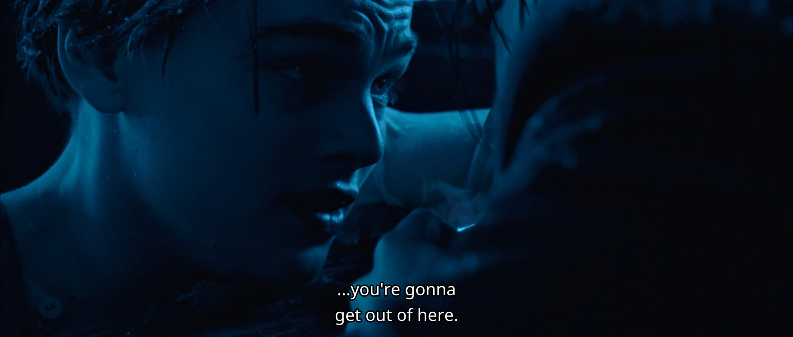

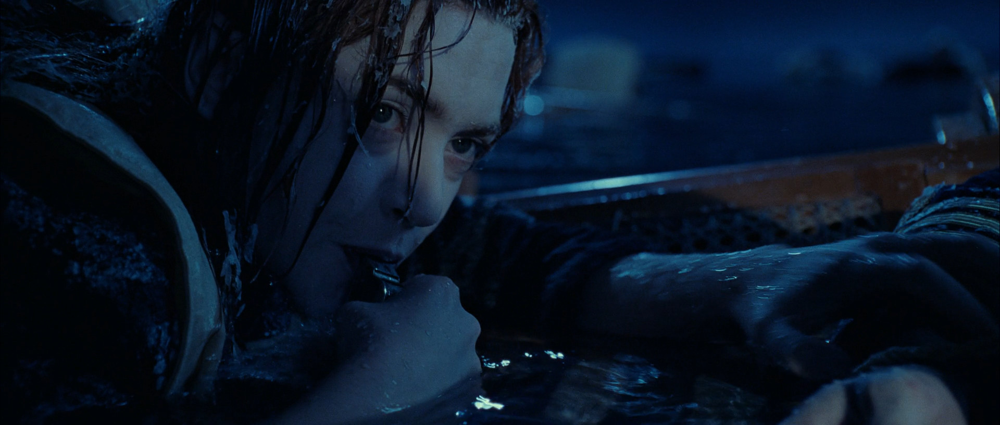

## 临终时的床头要摆什么？

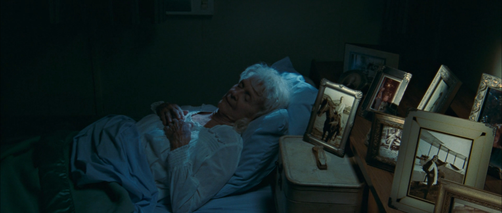

*看完这一幕，我不禁在想：我临终时的床头，会摆点什么呢？*

## 愿有情人终成眷属

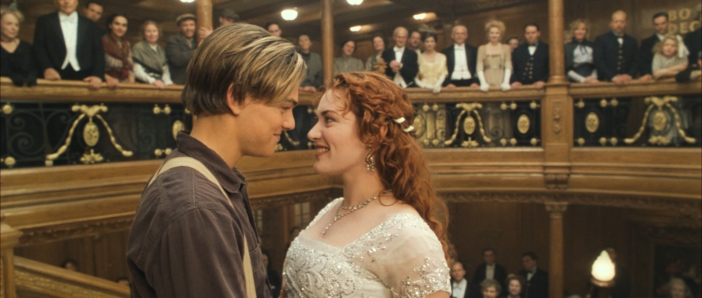

加上上一个画面，这电影的结尾一下子让我哭两次。真强。

## One more thing: 蓝宝石之谜

其实在Rose临终一幕之前，有一段她在船尾向大海抛下海洋之心（一颗硕大的蓝宝石）的情节。整段剧情除了语气词没有一句台词。整段对Rose的内心活动的描写都是极其克制且含蓄的，不禁让人猜想她当时是怀着怎样的心情，来丢下这颗她藏匿了大半辈子的宝物。

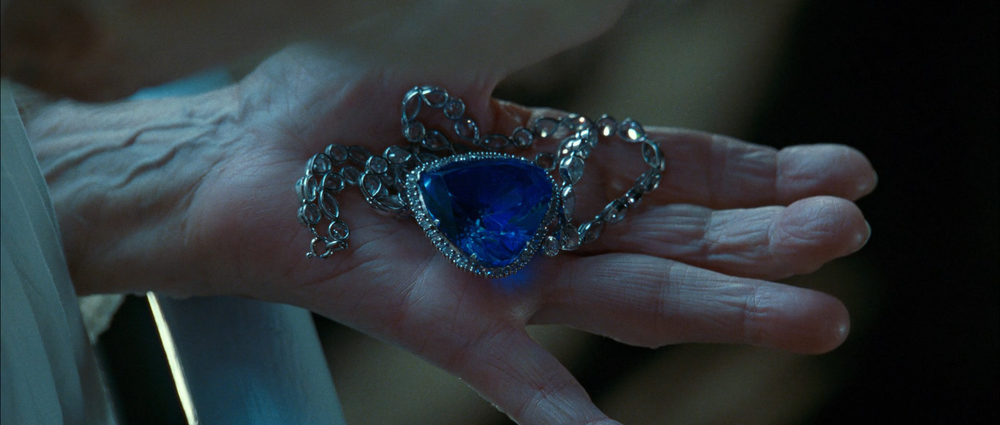

最开始我也没有确切的想法，猜想，也就是和这段回忆说再见了，毕竟命不久矣了。还有就是，这蓝宝石或许是作为她和Jack唯二留在世上的回忆，此举便是赠予长眠于此的，改变了她一生的他的最后礼物。

然后，我就看到了白金版（删节片段）这段剧情的另一个版本：

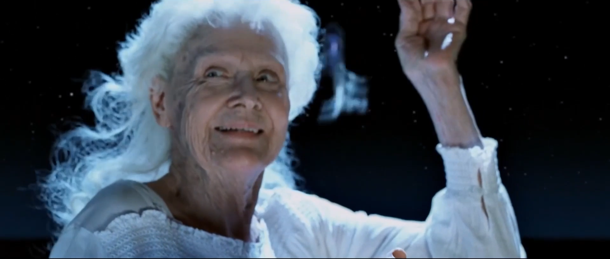

大致剧情是，Rose丢宝石的时候被船上的人发现了，然后就说，自己当时发现了自己口袋里放着这颗宝石，只是卖了它就可以此生无忧，然而她没有那么做，只是依靠自己过到了现在balabala. 大概是所有人都觉得说教意味太重了，所以就没有采用这个版本的剧情。不过，作为理解Rose此时的心理活动和行为动机，是一段非常重要的参考内容。
