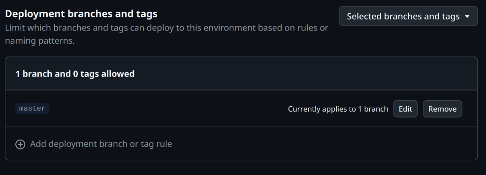

## Introduction  
Developers who have modified open-source software know that modified packages need to be distributed for installation. The most efficient approach is to build a dedicated package repository, which integrates with system package managers and ensures timely updates. Examples are Arch Linux’s ArchCN and Debian’s PPA (Personal Package Archive).  

Traditional repository setups often require complex tools or systems like Open Build Service (OBS). However, this guide focuses on lightweight methods suitable for distributing self-maintained packages.  

While this article specifically covers Debian `.deb` packages, the principles can be adapted to other package management systems.  

## Core Idea  
Use `reprepro` to create a software repository. After packaging your software, import it into the repository using `reprepro`. Host the repository via HTTP (e.g., GitHub Pages) to make it publicly accessible.  

## Direct Method  
GitHub Pages provides free static site hosting. You can host your repository as a Git repository on GitHub and use GitHub Pages to serve it. For setup details, refer to [SetupWithReprepro](https://wiki.debian.org/DebianRepository/SetupWithReprepro). Below are the simplified repo setup steps using `reprepro`:  

### Key Steps:  

- Generate a GPG signing key:

    ```bash
    gpg --gen-key
    ```
    
- Get the private key fingerprint (e.g., `9FCD68DE8EFE8EC94ABEFDCB4FC5CF6FC16FDEF3`):  
  ```bash
  $ gpg --list-secret-keys sign@example.com
  sec   ed25519 2025-05-17 [SC] [expires: 2028-05-16]
        9FCD68DE8EFE8EC94ABEFDCB4FC5CF6FC16FDEF3
  uid           [ultimate] Signing bot <sign@example.com>
  ssb   cv25519 2025-05-17 [E] [expires: 2028-05-16]
  ```
  
- Export the public key for users to verify signatures:  
  ```bash
  gpg --export --armor 9FCD68DE8EFE8EC94ABEFDCB4FC5CF6FC16FDEF3 > public.key
  ```

- Create repository directories:
   ```bash
   mkdir -p /path/to/your/repo
   mkdir -p /path/to/your/repo/conf
   ```

- Configure `/path/to/your/repo/conf/distributions`:
   ```
   Codename: <release-name>
   Suite: <release-pseudonym>
   Architectures: source i386 amd64 <...>
   Components: main <...>
   Contents:
   SignWith: <fingerprint>
   Origin: <Your project name>
   Label: <Your project name>
   Description: <Your project description>
   ```
   For configuration details, see [Configure reprepro](https://wiki.debian.org/DebianRepository/SetupWithReprepro#Configure_reprepro).

- Create `/path/to/your/repo/conf/options`:

    ```bash
    cd /path/to/your/repo
    
    # Calling reprepro will behave normally at first...
    reprepro ...
    
    # ... set some default options ...
    cat > conf/options <<EOF
    verbose
    ask-passphrase
    EOF
    
    # ... now it acts like you called `reprepro --verbose --ask-passphrase`:
    reprepro ...
    ```

- Build `.deb` packages.

- Add packages to the repository. Choose one from the following two methods according to your case.

    - Use `.changes` files:  
      
      ```bash
      reprepro -b /path/to/your/repo include <release-name> <package>.changes
      ```
      
    - Use standalone `.deb` files:  
      ```bash
      reprepro -b /path/to/your/repo includedeb <release-name> <package>.deb
      ```
    
    > Use `--ignore wrongdistribution` if package codename mismatches.

- Commit the repository to Git and push to GitHub.

- Enable GitHub Pages for the repository branch. Users can then add your repository with:  

```
deb [signed-by=/path/to/public.key] https://username.github.io/repo-name release-name component
```
Replace placeholders accordingly.  

## Workflow Method  

Given the simplicity and clarity of the aforementioned method, one might inquire as to the necessity of this particular section. Ah, a closer examination of [GitHub's single-file repository limits](https://docs.github.com/en/repositories/working-with-files/managing-large-files/about-large-files-on-github) reveals the underlying reason. Specifically, when a single file within a repository exceeds 100MB—a common occurrence with larger software packages—the adoption of Git LFS becomes imperative for its hosting. However, [Git LFS also imposes free tier limitations](https://docs.github.com/en/repositories/working-with-files/managing-large-files/about-storage-and-bandwidth-usage#storage-quota). Upon exceeding 1GB of usage, one is compelled to either upgrade their membership or acquire additional data packages. In essence, the cost-effectiveness of this approach is, in my estimation, rather unfavorable. ~~(The author, regrettably, did incur these expenses for a few months.)~~

To circumvent this predicament, it becomes necessary to address the issue of directly hosting software packages within the repository. A highly pragmatic solution involves leveraging GitHub Releases for the hosting of compiled software packages. (Previously, a lapse in judgment led to the use of GitHub Pages.) ~~One might ponder, if GitHub Pages were already in use, whether it would not be feasible to import packages within the workflow during site creation, thereby establishing the repository. After all, [GitHub Actions' free runner machines](https://docs.github.com/en/actions/using-github-hosted-runners/using-github-hosted-runners/about-github-hosted-runners#standard-github-hosted-runners-for-public-repositories) and [GitHub Pages' size limitations](https://docs.github.com/en/pages/getting-started-with-github-pages/github-pages-limits) are demonstrably more lenient than those of Git LFS.~~

Whence, then, do these software packages originate? This question, naturally, invites diverse perspectives. However, from the vantage point of the repositories I currently maintain, the source code repositories requiring packaging reside on GitHub and are already configured with build and test CI. Consequently, extending these with a distribution CD process represents a logical progression. Thus, my current architectural design entails organizing the software packages subsequent to their test build, followed by the implementation of two distinct strategies:

Publishing the software packages to GitHub Releases. This approach offers the advantage of not consuming GitHub Pages bandwidth and provides users with a straightforward and intuitive download experience.
Distributing them to a sub-path on the current account's GitHub Pages, named after the software. Indeed, each software package's code repository will also generate a corresponding GitHub Pages site. This yields two principal benefits:

	1. Subsequent repository build processes can directly retrieve the packages from this sub-page.
	1. The build artifacts of the test workflow are no longer subject to temporal expiration, but are instead persistently maintained by GitHub Pages. (Though publication via GitHub Release also offers persistence.)

## Workflow Methodology

Given the simplicity and clarity of the aforementioned method, one might inquire as to the necessity of this particular section. Ah, a closer examination of [GitHub's single-file repository limits] reveals the underlying reason. Specifically, when a single file within a repository exceeds 100MB—a common occurrence with larger software packages—the adoption of Git LFS becomes imperative for its hosting. However, [Git LFS also imposes free tier limitations]. Upon exceeding 1GB of usage, one is compelled to either upgrade their membership or acquire additional data packages. In essence, the cost-effectiveness of this approach is, in my estimation, rather unfavorable. (The author, regrettably, did incur these expenses for a few months.)

To circumvent this predicament, it becomes necessary to address the issue of directly hosting software packages within the repository. A highly pragmatic solution involves leveraging GitHub Releases for the hosting of compiled software packages. (Previously, a lapse in judgment led to the use of GitHub Pages.) One might ponder, if GitHub Pages were already in use, whether it would not be feasible to import packages within the workflow during site creation, thereby establishing the repository. After all, [GitHub Actions' free runner machines] and [GitHub Pages' size limitations] are demonstrably more lenient than those of Git LFS.

Whence, then, do these software packages originate? This question, naturally, invites diverse perspectives. However, from the vantage point of the repositories I currently maintain, the source code repositories requiring packaging reside on GitHub and are already configured with build and test CI. Consequently, extending these with a distribution CD process represents a logical progression. Thus, my current architectural design entails organizing the software packages subsequent to their test build, followed by the implementation of two distinct strategies:

- Publishing the software packages to GitHub Releases. This approach offers the advantage of not consuming GitHub Pages bandwidth and provides users with a straightforward and intuitive download experience.
- Distributing them to a sub-path on the current account's GitHub Pages, named after the software. Indeed, each software package's code repository will also generate a corresponding GitHub Pages site. This yields two principal benefits:
  1. Firstly, subsequent repository build processes can directly retrieve the packages from this sub-page.
  2. Secondly, the build artifacts of the test workflow are no longer subject to temporal expiration, but are instead persistently maintained by GitHub Pages. (Though publication via GitHub Release also offers persistence.)

### GitHub Release-Based Approach

#### Key Components of the Packaging Workflow

Let us again consider [kernel_sony_sm8250](https://github.com/ArchieMeng/kernel_sony_sm8250/tree/3545b69d5af39551fdcac97cb46d56380ad94acc) as an illustrative example.

```
YAML- name: Get version
  run: echo "version=$(head -n1 debian/changelog | cut -d '(' -f2 | cut -d ')' -f1 | sed 's/+/-/g')" >> $GITHUB_ENV
- name: Create latest release
  uses: softprops/action-gh-release@v2.2.2
  with:
    files: /tmp/results/*
    tag_name: ${{ env.version }}
    draft: false
```

Initially, the current version number must be extracted from `debian/changelog`. Within this project, the changelog version is generated by `releng-build-package` (which reuses `gbp`'s build script). Distinct matching rules apply for different version generation methodologies. The subsequent release will utilize this version number as its tag.

The process then proceeds with the upload and related operations.

#### Key Components of the Software Repository Build Workflow

Here, we shall use this version of [custom-debs](https://github.com/ArchieMeng/custom-debs/tree/a1f17eeea13d83529bcbeb146eee32e4e53070d) as an example.

```yaml
- name: Create Packages
env:
  GH_TOKEN: ${{ github.token }}
run: |
  mkdir -p packages
  while read rep; do
    echo "Download $rep"
    gh release download -D packages -p "*.deb" -R "$rep"
  done < package_repos

- name: Create APT Repository
id: create-apt-repo
uses: morph027/apt-repo-action@v3.6
with:
  repo-name: ${{ env.REPO_NAME }}
  scan-dir: ./packages  # Use the 'scan-dir' option
  signing-key: ${{ secrets.SIGNING_KEY }}
  codename: ${{ env.CODENAME }}
  components: ${{ env.COMPONENTS }}
  architectures: ${{ env.ARCHITECTURES }}
  import-from-repo-url: "https://archiemeng.github.io/custom-debs"
```

Herein, the project names from which `.deb` packages are to be retrieved from releases are first read from `package_repos`. These names adhere to the `<owner>/<repo>` format, with each repository listed on a separate line.

Subsequently, the repository's various attributes are configured based on environment and secret variables.

To employ this workflow, the following variables necessitate definition:

- Workflow Environment Variables

  ```yaml
  env:
    CODENAME: trixie
    COMPONENTS: main
    ARCHITECTURES: "arm64"
  ```

- Project Secret Variable `SIGNING_KEY`. This variable can be populated within `Project Settings > Security > Secrets and variables > Actions`. (It can be exported via `gpg --export-secret-keys -a <fingerprint>`.)

- Modification of GitHub Pages Default Branch Protection Rules:

  Within `Project Settings > Environments > github-pages (click to access configuration page) > Deployment branches and tags`, adjust the branches or tags permitted for deployment.

The configuration appears approximately as follows:



### GitHub Pages-Based Approach (Deprecated)

**[From Droidian Sony Pdx206 Kernel Repository](https://github.com/ArchieMeng/kernel_sony_sm8250/blob/78703e21ebb86fb0b6e5bc91d8c7b671696f0bd0/.github/workflows/build.yml)**:  

```yaml
name: Build CI

on:
  push:
    branches: [ "droidian" ]
  pull_request:
    branches: [ "droidian" ]

# Sets permissions of the GITHUB_TOKEN to allow deployment to GitHub Pages
permissions:
  contents: read
  pages: write
  id-token: write

# Allow only one concurrent deployment, skipping runs queued between the run in-progress and latest queued.
# However, do NOT cancel in-progress runs as we want to allow these production deployments to complete.
concurrency:
  group: "pages"
  cancel-in-progress: false

jobs:
  build:

    runs-on: ubuntu-latest

    steps:
    - uses: actions/checkout@v4
    - name: Make output dir
      run: mkdir -pv /tmp/results
    - name: Build packages in the container
      run: |
        docker run \
        -v ${{ github.workspace }}:/sources -v /tmp/results:/results \
        quay.io/droidian/build-essential:current-amd64 /bin/bash -c '''
        apt-get install linux-packaging-snippets
        cd /sources
        RELENG_HOST_ARCH="arm64" releng-build-package
        mv -v ../*.deb ../*.buildinfo ../*.changes /results
        '''
    - uses: actions/upload-artifact@v4
      with:
        path: /tmp/results
    - name: Generate files for Github Page of this repo
      run: |
        cd /tmp/results
        ls -1 > files

        # Generate index.html
        # Get the current working directory
        dir=$(pwd)

        # Create an index.html file
        echo '<!DOCTYPE html><html><head><title>Index</title></head><body>' > index.html

        # Loop through all files in the directory
        for file in *; do
            # Check if the file is not the index.html file itself
            if [ $file != "index.html" ]; then
                # Add a link to the file in the index.html file
                echo "<a href=\"$file\">$file</a><br>" >> index.html
            fi
        done

        # Close the HTML tags
        echo "</body></html>" >> index.html
    - name: Upload pages artifact
      uses: actions/upload-pages-artifact@v3
      with:
        path: /tmp/results
  deploy:
    environment:
      name: github-pages
      url: ${{ steps.deployment.outputs.page_url }}
    runs-on: ubuntu-latest
    needs: build
    steps:
      - name: Deploy to GitHub Pages
        id: deployment
        uses: actions/deploy-pages@v4
```

This section uses the `releng` build tool provided by Droidian (which I later discovered is part of the gbp/Git Build Package toolchain) for packaging. For regular Debian packages, you can also use `dpkg-buildpackage` directly. The major difference between these two methods is that, `releng` will use git informations as version name while `dpkg-buildpacakge` will strictly follow the version name recorded in `debian/changelog`. Signing during this stage is optional since packages will be signed together during repository import stage.

```yaml
- name: Generate files for Github Page of this repo
  run: |
    cd /tmp/results
    ls -1 > files

    # Generate index.html
    # Get the current working directory
    dir=$(pwd)

    # Create an index.html file
    echo '<!DOCTYPE html><html><head><title>Index</title></head><body>' > index.html

    # Loop through all files in the directory
    for file in *; do
        # Check if the file is not the index.html file itself
        if [ $file != "index.html" ]; then
            # Add a link to the file in the index.html file
            echo "<a href=\"$file\">$file</a><br>" >> index.html
        fi
    done

    # Close the HTML tags
    echo "</body></html>" >> index.html
```

This step generates a directory listing page to display build artifacts when accessing the repository subpath directly.

### Repository Build Workflow Example  

This process is significantly simpler than manual repository setup thanks to the pre-existing [morph027/apt-repo-action@v3.6](https://github.com/morph027/apt-repo-action) workflow. You only need to:

1. **Configure essential parameters**:  
   Set repository metadata in workflow environment variables
2. **Handle cryptographic signing**:  
   Store your private GPG key in GitHub Secrets (`SIGNING_KEY`)
3. **Key distribution**:  
   Export the public key using:  
   
   ```bash
   gpg --export --armor [fingerprint] > public.key

> Replace `fingerprint` with the actual one of your public key.

**[Workflow from ArchieMeng/custom-debs](https://github.com/ArchieMeng/custom-debs/blob/2b8c360fefad80d80f553d101f84772b6b87d72b/.github/workflows/generate.yml)**:  

```yaml
name: Generate and Deploy Debian Repo

on:
  schedule:
    - cron: "0 23 * * *"  # run daily
  push:
  workflow_dispatch:

permissions:
  contents: read
  pages: write
  id-token: write

env:
  CODENAME: trixie
  COMPONENTS: main
  ARCHITECTURES: "arm64"

jobs:
  build:
    runs-on: ubuntu-latest
    outputs:
      artifact_id: ${{ steps.upload-artifact.outputs.artifact-id }}
      keyring: ${{ steps.create-apt-repo.outputs.keyring }}
    steps:
      - name: Extract repository name
        id: repo-info
        run: |
          # Split 'owner/repo' string into its components
          echo "REPO_NAME=$(echo ${{ github.repository }} | cut -d'/' -f2)" >> $GITHUB_ENV

      - name: Checkout code
        uses: actions/checkout@v4

      - name: Setup Pages
        uses: actions/configure-pages@v4

      - name: Create Packages
        run: |
          mkdir -p packages
          while read package_url; do
            echo "Processing package URL: $package_url"
            package_base_url="$package_url"
            files_url="$package_base_url/files"

            # Download the "files" list
            wget -q "$files_url" -O files.list
            if [ -s "files.list" ]; then # Check if files.list exists and is not empty
              while read package_file; do
                package_file_url="$package_base_url/$package_file"
                echo "Downloading package: $package_file_url"
                wget -q "$package_file_url" -P packages
                if [ ! -f "packages/$package_file" ]; then
                  echo "Error downloading package file: $package_file_url"
                  exit 1 # Exit the workflow on error
                fi
              done < files.list
              rm files.list # Clean up files.list
            else
              echo "Error: Could not download or empty files.list from $files_url"
              exit 1 # Exit the workflow on error
            fi
          done < package_url.list
      - name: Create APT Repository
        id: create-apt-repo
        uses: morph027/apt-repo-action@v3.6
        with:
          repo-name: ${{ env.REPO_NAME }}
          scan-dir: ./packages  # Use the 'scan-dir' option
          signing-key: ${{ secrets.SIGNING_KEY }}
          codename: ${{ env.CODENAME }}
          components: ${{ env.COMPONENTS }}
          architectures: ${{ env.ARCHITECTURES }}
          import-from-repo-url: "https://archiemeng.github.io/custom-debs"


      - name: Upload Pages artifact
        uses: actions/upload-pages-artifact@v3
        with:
          name: github-pages
          path: ${{ steps.create-apt-repo.outputs.dir }}

  deploy:
    environment:
      name: github-pages
      url: ${{ steps.deployment.outputs.page_url }}
    runs-on: ubuntu-latest
    needs: build
    steps:
      - name: Deploy to GitHub Pages
        id: deployment
        uses: actions/deploy-pages@v4
```
To properly use this workflow, you must configure these essential elements:

- Workflow Environment Variables

  ```yaml
  env:
    CODENAME: trixie
    COMPONENTS: main
    ARCHITECTURES: "arm64"
  ```

- Repository Secret
  Configure the GPG signing key via:
  `Project Settings > Security > Secrets and variables > Actions`

  - Secret name: `SIGNING_KEY`
  - Value: ASCII-armored GPG private key (export with `gpg --export-secret-keys -a <fingerprint>`)

- GitHub Pages Deployment Rules
  Update branch protection settings with `Project Settings > Environments > github-pages > Deployment branches`. Adjust deployment rules to match your workflow requirements:

  It should be like this:

  

## Conclusion  
These are the two methods I've used for setting up simple software repositories on GitHub. If you don't need to distribute very large packages or lack a dedicated package build workflow, the first, simplest, and most direct method is suitable. However, if you're like me and need to distribute large packages and have a complete build and distribution workflow, you might consider trying the second method, which is entirely workflow-based.

Naturally, these methods aren't without their limitations. For instance, the process of managing packages within these self-hosted repositories doesn't inherently handle inter-package dependencies. But for small repositories of this size, this situation typically isn't a concern. :)