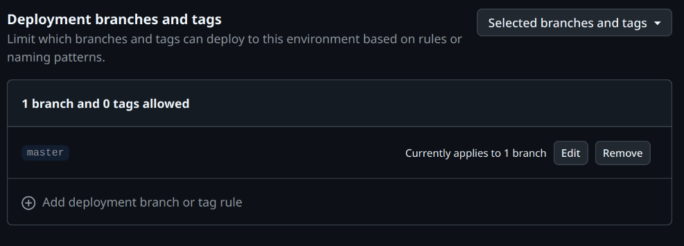

## 引言
有过自己开发修改开源软件经验的人应该都清楚，改好的软件包最后都是要分发出去给人安装起来的。最合适的方式就是构建一个自己的软件包仓库，这样能整合进系统，同时也能保证及时更新。这也就是类似现在 Arch 系的 ArchCN，Debian 系里的 PPA 的东西。
一般构建仓库都需要专门的工具，甚至庞大的系统，比如 OBS. 但，这次我要介绍的并不是那种构建大而全包仓库系统的方法。相反，它们是一些非常简单，适合只需要分发自己打包的仓库构建方法。

本文仅介绍 Debian 系 Deb 包的打包建仓方法，但其思路同样可以用于构建其他包管理系统的软件仓库。

## 核心思路

使用`reprepro`建立软件仓库。通过某种方式打包好软件之后，再使用 `reprepro` 导入仓库。仓库内容通过 HTTP 服务公开为一个站点，使得所有人都可以公开使用生成好的软件仓库。

## 直接方式

Github 提供了 Github Page 这种 HTTP 站点服务。所以，可以将整个生成好的软件仓库作为一个 git 仓库托管到Github,然后用Github Page直接将该分支的内容作为 HTTP 站点的内容来提供软件仓库服务。构建仓库的过程具体可以参考 Debian 官方的 [SetupWithReprepro](https://wiki.debian.org/DebianRepository/SetupWithReprepro) 或其他文档。这里以我之前用过的 `reprepro` 来讲解建仓流程。

核心步骤如下：

- gpg生成签名密钥

  ```bash
  gpg --gen-key
  ```

- 记得记下生成密钥的私钥指纹。比如：

  ```bash
  $ gpg --list-secret-keys sign@example.com
  sec   ed25519 2025-05-17 [SC] [expires: 2028-05-16]
        9FCD68DE8EFE8EC94ABEFDCB4FC5CF6FC16FDEF3
  uid           [ultimate] Signing bot <sign@example.com>
  ssb   cv25519 2025-05-17 [E] [expires: 2028-05-16]
  ```

  以上的示例`9FCD68DE8EFE8EC94ABEFDCB4FC5CF6FC16FDEF3`就是后面要用的签名私钥指纹。实际需要替换成真正使用的密钥指纹。

  同时，记得导出公钥以便仓库用户能够验证签名。

  ```bash
  gpg --export --armor 9FCD68DE8EFE8EC94ABEFDCB4FC5CF6FC16FDEF3 > public.key
  ```

- 创建软件仓库目录

  ```bash
  mkdir -p /path/to/your/repo
  mkdir -p /path/to/your/repo/conf
  ```

- 创建`/path/to/your/repo/conf/distributions`配置文件.

  ```
  Codename: <release-name>
  Suite: <release-pseudonym>
  Architectures: source i386 amd64 <...>
  Components: main <...>
  Contents:
  SignWith: <fingerprint>
  Origin: <Your project name>
  Label: <Your project name>
  Description: <Your project description>
  ```

  需要填的配置项的含义，请参考 [Configure reprepro](https://wiki.debian.org/DebianRepository/SetupWithReprepro#Configure_reprepro)

- 创建一个`/path/to/your/repo/conf/options`文件。大致如下：

  ```bash
  cd /path/to/your/repo
  
  # Calling reprepro will behave normally at first...
  reprepro ...
  
  # ... set some default options ...
  cat > conf/options <<EOF
  verbose
  ask-passphrase
  EOF
  
  # ... now it acts like you called `reprepro --verbose --ask-passphrase`:
  reprepro ...
  ```

- 打包 deb 包

- 将 deb 包添加进这个仓库。以下两种方法按需选择。

  - 使用`.changes`文件

  ```bash
  reprepro -b /path/to/your/repo include <release-name> <package>.changes
  ```

  - 使用 deb 包文件

  ```bash
  reprepro -b /path/to/your/repo includedeb <release-name> <package>.deb
  ```


> 假如软件包的release-name和仓库的不一致，则可以使用 “--ignore wrongdistribution”选项进行导入。

- 将本地配置生成的软件仓库目录添加为git repo

- git 仓库推送到 Github

- Github 仓库开启 Github Pages 功能，并选择从当前分支部署。等 Github Page 完成之后，这个新建的仓库就可以被公开访问使用了。

- 用户端使用的 source.list 配置大概如下：

  ```
  deb [signed-by=/path/to/public.key] https://username.github.io/repo-name release-name component
  ```

  替换其中需要替换的部分。

## 工作流方法

既然上面的方法简单明了，为何会有这一节呢？欸嘿，[Github 对仓库的单文件限制](https://docs.github.com/en/repositories/working-with-files/managing-large-files/about-large-files-on-github) 了解一下。也就是说，当仓库的单个文件超过100MB时（一般是比较大的软件包），就不得不开启Git LFS来托管该文件了。而 [Git LFS 也是有免费额度限制](https://docs.github.com/en/repositories/working-with-files/managing-large-files/about-storage-and-bandwidth-usage#storage-quota)的。当用了超过1GB之后，就不得不升级会员或者买数据包了。价格总之，我觉得很不划算。~~（结果笔者还是当了几个月冤大头，开了一会。）~~

为了绕过这种情况，需要解决不应该直接在仓库里托管软件包的问题。既然都用 Github Pages 了，那我在它建站的时候，在工作流里导入软件包来建仓不是也可以吗？毕竟[ Github 工作流免费运行机器](https://docs.github.com/en/actions/using-github-hosted-runners/using-github-hosted-runners/about-github-hosted-runners#standard-github-hosted-runners-for-public-repositories)和[ Github Pages 的大小限制](https://docs.github.com/en/pages/getting-started-with-github-pages/github-pages-limits)显然比 Git LFS 的更加宽松。

而软件包从何而来？这就见仁见智了。不过就我自己目前在维护的仓库来看，需要打包的软件源码仓库都在Github上，且都配置了构建测试 CI，那么多走一步给它们都加上分发的CD流程也是顺理成章的。所以，我目前的设计是在测试构建之后，将软件包整理，分发到软件名子路径的本账号 Github Pages 上。没错，每个软件包代码仓库也将生成一个对应软件包的 Github Pages 页面。这样有两点好处：

1. 之后仓库构建流程只需要直接从这个子页面下载软件包即可。
1. 测试工作流的构建产物不再随时间失效，而是被 Github Pages 持久化了。（尽管也可以通过 Github Release 发布）

### 打包工作流

**[来自 Droidian Sony Pdx206 内核仓库的样例](https://github.com/ArchieMeng/kernel_sony_sm8250/blob/78703e21ebb86fb0b6e5bc91d8c7b671696f0bd0/.github/workflows/build.yml)：**

```yaml
name: Build CI

on:
  push:
    branches: [ "droidian" ]
  pull_request:
    branches: [ "droidian" ]

# Sets permissions of the GITHUB_TOKEN to allow deployment to GitHub Pages
permissions:
  contents: read
  pages: write
  id-token: write

# Allow only one concurrent deployment, skipping runs queued between the run in-progress and latest queued.
# However, do NOT cancel in-progress runs as we want to allow these production deployments to complete.
concurrency:
  group: "pages"
  cancel-in-progress: false

jobs:
  build:

    runs-on: ubuntu-latest

    steps:
    - uses: actions/checkout@v4
    - name: Make output dir
      run: mkdir -pv /tmp/results
    - name: Build packages in the container
      run: |
        docker run \
        -v ${{ github.workspace }}:/sources -v /tmp/results:/results \
        quay.io/droidian/build-essential:current-amd64 /bin/bash -c '''
        apt-get install linux-packaging-snippets
        cd /sources
        RELENG_HOST_ARCH="arm64" releng-build-package
        mv -v ../*.deb ../*.buildinfo ../*.changes /results
        '''
    - uses: actions/upload-artifact@v4
      with:
        path: /tmp/results
    - name: Generate files for Github Page of this repo
      run: |
        cd /tmp/results
        ls -1 > files

        # Generate index.html
        # Get the current working directory
        dir=$(pwd)

        # Create an index.html file
        echo '<!DOCTYPE html><html><head><title>Index</title></head><body>' > index.html

        # Loop through all files in the directory
        for file in *; do
            # Check if the file is not the index.html file itself
            if [ $file != "index.html" ]; then
                # Add a link to the file in the index.html file
                echo "<a href=\"$file\">$file</a><br>" >> index.html
            fi
        done

        # Close the HTML tags
        echo "</body></html>" >> index.html
    - name: Upload pages artifact
      uses: actions/upload-pages-artifact@v3
      with:
        path: /tmp/results
  deploy:
    environment:
      name: github-pages
      url: ${{ steps.deployment.outputs.page_url }}
    runs-on: ubuntu-latest
    needs: build
    steps:
      - name: Deploy to GitHub Pages
        id: deployment
        uses: actions/deploy-pages@v4
```

其中：

```yaml
- name: Build packages in the container
  run: |
    docker run \
    -v ${{ github.workspace }}:/sources -v /tmp/results:/results \
    quay.io/droidian/build-essential:current-amd64 /bin/bash -c '''
    apt-get install linux-packaging-snippets
    cd /sources
    RELENG_HOST_ARCH="arm64" releng-build-package
    mv -v ../*.deb ../*.buildinfo ../*.changes /results
    '''
```

这一部分是通过 Droidian 提供的 releng 构建工具（后面查了下看，好像是 gbp 构建工具的一部分）去打包。一般的 Debian 软件包也可以直接使用 dpkg-buildpackage 去打包。唯一的区别是 releng 是 gbp 的构建工具，会使用 git 信息去打版本号，而 dpkg-buildpackage 会从严格按照 debian/changelog 中的版本号。打出来的包不需要签名，之后导入仓库的时候会统一进行签名。

```yaml
- name: Generate files for Github Page of this repo
  run: |
    cd /tmp/results
    ls -1 > files

    # Generate index.html
    # Get the current working directory
    dir=$(pwd)

    # Create an index.html file
    echo '<!DOCTYPE html><html><head><title>Index</title></head><body>' > index.html

    # Loop through all files in the directory
    for file in *; do
        # Check if the file is not the index.html file itself
        if [ $file != "index.html" ]; then
            # Add a link to the file in the index.html file
            echo "<a href=\"$file\">$file</a><br>" >> index.html
        fi
    done

    # Close the HTML tags
    echo "</body></html>" >> index.html
```

生成目录页面，以方便直接访问项目子路径时显示构建产物列表。

### 仓库构建工作流

因为可以直接借用现有的 morph027/apt-repo-action@v3.6 建仓工作流，所以这一部分反倒比自己手动建仓简单很多。仅需填写一些必要的仓库信息并准备自己的签名密钥填入项目的 `SIGNING_KEY secrets` 即可。记得导出公钥想办法分发部署到需要添加源的设备上即可。

[ArchieMeng/custom-debs 的工作流](https://github.com/ArchieMeng/custom-debs/blob/2b8c360fefad80d80f553d101f84772b6b87d72b/.github/workflows/generate.yml):

```yaml
name: Generate and Deploy Debian Repo

on:
  schedule:
    - cron: "0 23 * * *"  # run daily
  push:
  workflow_dispatch:

permissions:
  contents: read
  pages: write
  id-token: write

env:
  CODENAME: trixie
  COMPONENTS: main
  ARCHITECTURES: "arm64"

jobs:
  build:
    runs-on: ubuntu-latest
    outputs:
      artifact_id: ${{ steps.upload-artifact.outputs.artifact-id }}
      keyring: ${{ steps.create-apt-repo.outputs.keyring }}
    steps:
      - name: Extract repository name
        id: repo-info
        run: |
          # Split 'owner/repo' string into its components
          echo "REPO_NAME=$(echo ${{ github.repository }} | cut -d'/' -f2)" >> $GITHUB_ENV

      - name: Checkout code
        uses: actions/checkout@v4

      - name: Setup Pages
        uses: actions/configure-pages@v4

      - name: Create Packages
        run: |
          mkdir -p packages
          while read package_url; do
            echo "Processing package URL: $package_url"
            package_base_url="$package_url"
            files_url="$package_base_url/files"

            # Download the "files" list
            wget -q "$files_url" -O files.list
            if [ -s "files.list" ]; then # Check if files.list exists and is not empty
              while read package_file; do
                package_file_url="$package_base_url/$package_file"
                echo "Downloading package: $package_file_url"
                wget -q "$package_file_url" -P packages
                if [ ! -f "packages/$package_file" ]; then
                  echo "Error downloading package file: $package_file_url"
                  exit 1 # Exit the workflow on error
                fi
              done < files.list
              rm files.list # Clean up files.list
            else
              echo "Error: Could not download or empty files.list from $files_url"
              exit 1 # Exit the workflow on error
            fi
          done < package_url.list
      - name: Create APT Repository
        id: create-apt-repo
        uses: morph027/apt-repo-action@v3.6
        with:
          repo-name: ${{ env.REPO_NAME }}
          scan-dir: ./packages  # Use the 'scan-dir' option
          signing-key: ${{ secrets.SIGNING_KEY }}
          codename: ${{ env.CODENAME }}
          components: ${{ env.COMPONENTS }}
          architectures: ${{ env.ARCHITECTURES }}
          import-from-repo-url: "https://archiemeng.github.io/custom-debs"


      - name: Upload Pages artifact
        uses: actions/upload-pages-artifact@v3
        with:
          name: github-pages
          path: ${{ steps.create-apt-repo.outputs.dir }}

  deploy:
    environment:
      name: github-pages
      url: ${{ steps.deployment.outputs.page_url }}
    runs-on: ubuntu-latest
    needs: build
    steps:
      - name: Deploy to GitHub Pages
        id: deployment
        uses: actions/deploy-pages@v4
```

要使用这个工作流，需要定义以下几个变量:

- 工作流环境变量 

  ```yaml
  env:
    CODENAME: trixie
    COMPONENTS: main
    ARCHITECTURES: "arm64"
  ```

- 项目私密变量 SIGNING_KEY. 这个可以在`项目Settings > Security > Secrets and variables > Actions`里填写. (可以通过`gpg --export-secret-keys -a <fingerprint>`导出)

- 修改 Github Pages 默认分支保护规则: 

  在`项目Settings > Environments > github-pages (点击这个名字进入配置页面) > Deployment branches and tags` 调整允许部署的分支或标签

大概长这样的：



## 总结

以上便是我使用过的两种在 Github 上自建简易软件仓库的方法。对于不需要分发很大软件包或者没有自己的软件包构建工作流的情况，可以用第一种最简单直接的方法。而如果你像我一样需要分发大软件包，且有一套完善的构建分发工作流的话，不妨尝试一下第二种全部基于工作流的方法。

当然，这些方法也不是万全的。比如，自建仓库包的构建过程就没有考虑互相存在依赖的情况。不过，对于这种程度的小仓库，一般也不存在这种状况就是了。:)
