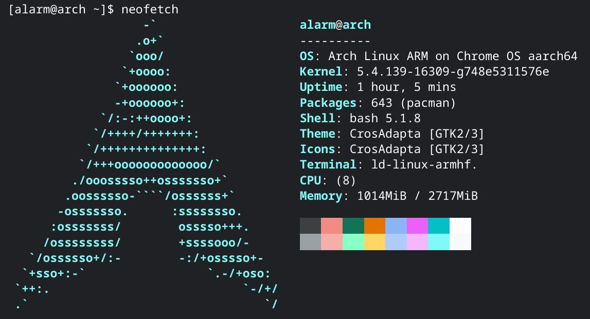

## Specs
[Lenovo Chromebook Duet (10.1") 2 in 1](https://www.lenovo.com/us/en/p/laptops/lenovo/lenovo-edu-chromebooks/lenovo-chromebook-duet-10/zziczctct1x)

- Processor: MediaTek® Helio P60T Processor (2.00 GHz, 8 Cores, 8 Threads)
- Operating System: Chrome OS
- Graphics: Integrated ARM Mali-G72 MP3 Graphics
- Memory: 4 GB LPDDR4x (Soldered)
- Storage: 64 GB eMMC
- Display: 10.1" FHD (1920 x 1200) IPS, touchscreen, 400 nits
- Camera: Front: 2 MP Fixed focus
- Rear: 8 MP Auto focus
- Battery: Li-Polymer
- Pen: None (USI protocol)
- Keyboard: US - English
- WLAN: 802.11AC (2 x 2)
- Bluetooth: Bluetooth® 4.2

## Performance
 Comparable to Snapdragon 660  
Geekbench Android: Single-core around 280-300, multi-core around 1300  
Geekbench Linux x86_64: High memory consumption, crashed during multi-core Horizon Detection project.

## Experience
Frequent lagging in daily use, attributed to the conservative 4 GB memory by Google.  
Linux app startup time is prolonged, with container Disk IO sequentially reading at around 120 MB, similar to a mechanical hard drive (considering that it's a 64 GB eMMC).

## Linux Support

Officially defaults to Debian, but switched to ArchLinux ARM.

## Arch Linux ARM
Please reference to arch wiki [crostini](https://wiki.archlinux.org/title/Chrome_OS_devices/Crostini).

## Can it run x86_64?
Yes, but only x64 for now (uncertain about x86 support in the future).

- Linux x64 programs can be run using Box64, requiring Box86 for both 32-bit and 64-bit support.
- Box86 compilation necessitates a 32-bit toolchain.
- Due to systemd-binfmt's inability to launch, the system cannot automatically invoke Box64 for x86_64 binaries, requiring manual intervention.
- binfmt_misc bug report and fixes for Chrome OS (https://bugs.chromium.org/p/chromium/issues/detail?id=1193426) (unprivileged container) However, manual binfmt_misc mounting and registration of x86_64 binary execution are still required. [Mounting method](https://www.kernel.org/doc/Documentation/admin-guide/binfmt-misc.rst)
- lib32-gcc and lib32-glibc are complicated, as they mutually depend on each other.

## Android Support?
~~Bilibili app displays black screen for videos, and my in-development Waifu2x ncnn cannot run, likely due to lack of video hardware decoding and Vulkan API in the container. (Strange that the YouTube Android client can play videos; perhaps there's a special technique involved?)~~

Since Google has already added Vulkan compatibility to their Android VM, these Vulkan-related issues no longer exist. Additionally, Bilibili has fixed the video playback problems.

Some games also stutter during loading screens, such as Blue Archive. However, Genshin Impact and Shoumetsu Toshi work fine.

## Conclusion
A Chromebook with decent productivity capabilities, supporting Linux and Android on a tablet form factor.