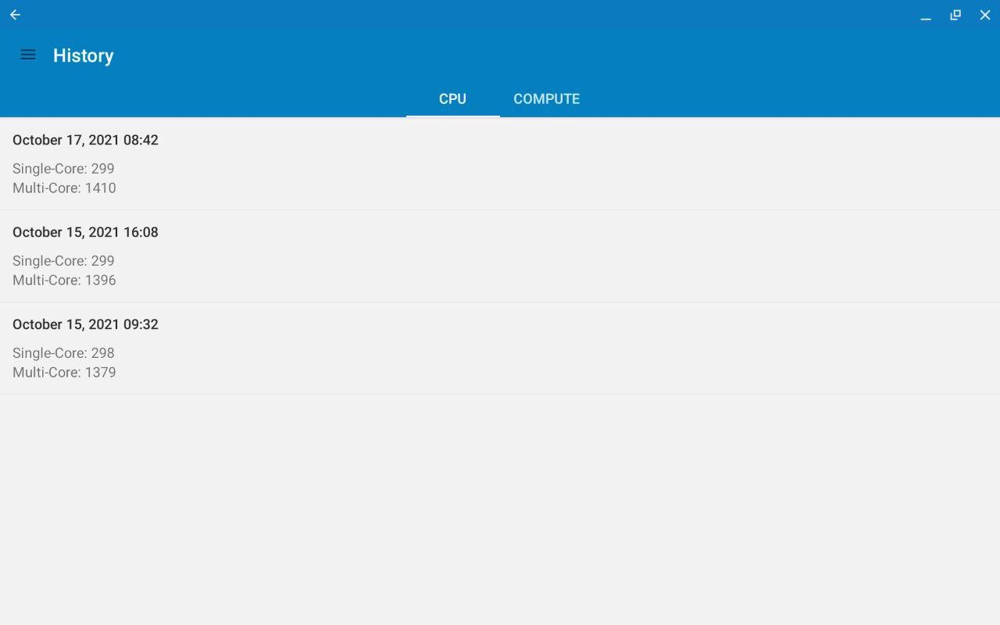
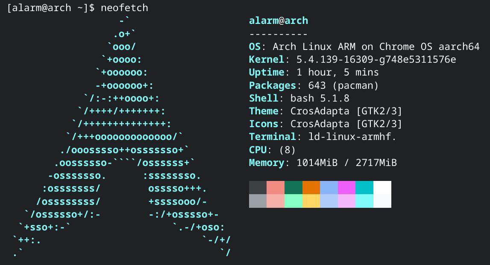

## Specs
[Lenovo Chromebook Duet (10.1") 2 in 1](https://www.lenovo.com/us/en/p/laptops/lenovo/lenovo-edu-chromebooks/lenovo-chromebook-duet-10/zziczctct1x)

- Processor : MediaTek® Helio P60T Processor (2.00 GHz, 8 Cores, 8 Threads)
- Operating System : Chrome OS
- Graphics : Integrated ARM Mali-G72 MP3 Graphics
- Memory : 4 GB LPDDR4x (Soldered)
- Storage : 64 GB eMMC
- Display : 10.1" FHD (1920 x 1200) IPS, touchscreen, 400 nits
- Camera : Front: 2 MP Fixed focus
- Rear: 8 MP Auto focus
- Battery : Li-Polymer
- Pen : None (USI protocol)
- Keyboard : US - English
- WLAN : 802.11AC (2 x 2)
- Bluetooth : Bluetooth® 4.2

## Performance
接近骁龙660
Geekbench Android 单核280～300，多核1300左右
Geekbench Linux x86_64 爆内存，在多核Horizon Detection项目跑挂了。

## Experience
日常卡顿，得益于谷歌保守的4G内存。
开Linux应用卡半天，测了下容器的Disk IO发现顺序读120M左右，和机械硬盘差不多。（毕竟是64G eMMC）

## Linux support

官方默认是Debian。但我改成ArchLinux ARM了。

## Arch Linux ARM
参考arch wiki [crostini](https://wiki.archlinux.org/title/Chrome_OS_devices/Crostini)。

## Can it run x86_64?
是的，但只能跑x64。（暂时是这样，不清楚后面能不能整出x86）

- 使用Box64便可以跑Linux x64的程序。但wine同时需要32位和64位支持，所以还需要Box86
- Box86编译需要32位的编译工具链
- 由于systemd-binfmt无法启动的问题，系统是无法自动对x86_64 binary调用box64的，所以只能手动做。
- binfmt_misc bug report and fixes for Chrome OS (https://bugs.chromium.org/p/chromium/issues/detail?id=1193426) (unprivileged container) 但实际上还是需要手动mount binfmt_misc，然后注册x86_64二进制执行方式。[mount方法](https://www.kernel.org/doc/Documentation/admin-guide/binfmt-misc.rst)
- lib32-gcc 和 lib32-glibc比较麻烦，他们居然互为依赖。

## Android support?
B站客户端视频黑屏，我在开发中的Waifu2x ncnn也没法跑，估计是容器没有视频硬解，Vulkan API。（奇怪的是Youtube的Android客户端却可以看视频，不明白啊。难道有特殊的技巧？）
部分游戏也卡加载画面，比如ブルーアーカイブ。
但原神，少前云图计划是可以的。

## 总结
有一定生产力的Chrome+Linux+Android平板。
