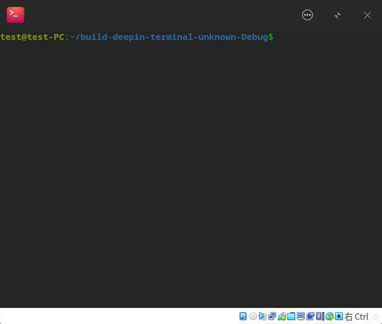

+++
title = '记一次实现＂自动隐藏标题栏的沉浸式全屏＂的过程'
date = 2023-03-26T20:46:00+08:00
draft = false
categories = ["Tech"]
tags = ["deepin", "C++", "deepin-terminal"]
image = "cover.jpg"
+++

#### 起因

https://bbs.deepin.org/zh/post/219784 帖子的七楼说希望全屏隐藏顶栏，然后就在哪里看到有人说旧版deepin-terminal的行为就是这样的．一试，果然．看样子必须要做了．

#### 计划实现方式

当时猜想有两种实现方法：

- 改windowFlags，让窗口标题栏隐藏．
- 找到Titlebar的对象，然后设置隐藏．

为了说明，以下代码均使用 [commit 8eea62a986f8d80562c3449985919980f6828eed](https://github.com/linuxdeepin/deepin-terminal/tree/8eea62a986f8d80562c3449985919980f6828eed) 的版本

#### 失败的尝试

首先，因为刚接触这个项目，对其具体代码了解也不是很深，想先用改windowFlags的方式去做．

搜索代码全文中的fullscreen：

```bash
$ grep -rnI "fullscreen" src
src/common/utils.cpp:310:                                      QString(QObject::tr("Set the window mode on starting") + " (normal, maximum, fullscreen, splitscreen)"),
src/common/utils.cpp:361:            QStringList validString = { "maximum", "fullscreen", "splitscreen", "normal" };
src/assets/deepin-terminal/terminal/en_US/terminal.md:132:2. Press **F11** to display Terminal in fullscreen.
src/assets/deepin-terminal/terminal/en_US/terminal.md:135:>  Notes: You can also right-click to select **Fullscreen** or **Exit fullscreen** on the Terminal interface.
src/assets/deepin-terminal/terminal/en_US/s_terminal.md:132:2. Press **F11** to display Terminal in fullscreen.
src/assets/deepin-terminal/terminal/en_US/s_terminal.md:135:> Notes: You can also right-click to select **Fullscreen** or **Exit fullscreen** on the Terminal interface.
src/assets/other/default-config.json:264:                            "key": "switch_fullscreen",
src/main/mainwindow.cpp:960:        else if (state == "fullscreen")
src/main/mainwindow.cpp:1059:    // switch_fullscreen
src/main/mainwindow.cpp:1060:    connect(createNewShotcut("shortcuts.advanced.switch_fullscreen"), &QShortcut::activated, this, &MainWindow::slotShortcutSwitchFullScreen);
src/main/mainwindow.cpp:2602:    } else if ("fullscreen" == windowState) {
src/settings/settings_translation.cpp:70:    auto shortcuts_advanced_switch_fullscreenName = QObject::tr("Fullscreen");
src/settings/settings_translation.cpp:71:    Q_UNUSED(shortcuts_advanced_switch_fullscreenName);
src/settings/settings.cpp:127:                          << "fullscreen");
src/views/termwidget.cpp:513:            m_menu->addAction(tr("Exit fullscreen"), this, &TermWidget::onSwitchFullScreen);
```

从搜索结果来看，不难得出 src/main/mainwindow.cpp 960行或许是进行全屏切换的位置，可以在这里设置windowFlags．而设置windowFlag Qt::FramelessWindowHint　理论上可以将标题栏隐藏．具体WindowFlags有哪些？效果怎样？可以参考编译QT官方的[example程序](https://code.qt.io/cgit/qt/qtbase.git/tree/examples/widgets/widgets/windowflags?h=6.4)

当然，就如标题所示，这个方法失败了．具体原因不明，可能哪里设置了其他WindowFlags导致没达到预期效果吧．

#### ~~Best Practice（最佳实践）~~ 反面教材

既然取巧不行，那就看看能不能找到Titlebar对象．一般titlebar就在MainWindow类里．但当时我脑抽了，忘记了，只是想起来远程管理功能在当前标签页有正在运行的命令的时候，会选择新开标签页进行远程登陆．通过远程管理的相关代码可以找到添加标签页的实现，并找到对应的标题栏实现．

远程管理的相关实现在src/remotemanage/中．根据名称，首先在remotemanagementpanel.cpp中找到clicked的信号连接（当远程服务项被点击的信号），并找到doConnectServer，然后在remotemanagementplugn.cpp (应该是typo)中找到连接远程服务器的对应实现．关键部分：

``` C++
void RemoteManagementPlugin::doCennectServer(ServerConfig *curServer)
{
....
// 第110行
        if (m_mainWindow->currentActivatedTerminal()->hasRunningProcess())
            m_mainWindow->addTab(m_mainWindow->currentPage()->createCurrentTerminalProperties(), true);
}
```

可以看到，是通过MainWindow的addTab方法添加新标签页的．在MainWindow::addTab方法中，找到了标签栏m_tabbar，然后通过m_tabbar又找到了m_titlebar．到这里，就基本找到了标题栏位置了（是吗？）

好，那我就直接试试给m_titlebar全屏时设置隐藏．
~~结果试试就逝世~~

NormalWindow::switchFullscreen改为如下：

```C++
void NormalWindow::switchFullscreen(bool forceFullscreen)
{
    if (forceFullscreen || !window()->windowState().testFlag(Qt::WindowFullScreen))
    {
        m_titleBar->setVisible(false);
        window()->setWindowState(windowState() | Qt::WindowFullScreen);
    }
    else
    {
        m_titleBar->setVisible(true);
        window()->setWindowState(windowState() & ~Qt::WindowFullScreen);
    }

    // 全屏和取消全屏后，都将焦点设置回终端
    focusCurrentPage();
}
```
效果如图



显然，m_titlebar并不是整个标题栏，只是其中的一部分．继续看看m_titlebar的从属关系，看到titlebar()．反应过来了，这个就是整个标题栏对应的实际对象．这是一个DTitlebar对象，然后在[dtk文档网站](https://linuxdeepin.github.io/dtkwidget/)上查询该类的信息，发现有[setAutoHideOnFullscreen()](https://linuxdeepin.github.io/dtkwidget/classDtk_1_1Widget_1_1DTitlebar.html#a1f6c489ac89d51bdca2ccce262144368)方法．所以，只需要在合适的地方设置就行．实际对应提交为https://github.com/linuxdeepin/deepin-terminal/commit/69274d9138a2fd401686ac2199ed3c251c2ff5fb

#### 总结

我比较习惯的快速上手项目方法大概就是：从功能表现上出发，找对应的代码实现;　重复这个过程，直到找到真正需要修改实现的部分．
