其实也不是说这两者有什么太大的关联，只是因为我~~最近~~(写稿子的时候的最近。要不是打开文件夹，我都忘记了。)刚好看完了这两个番。毕竟，如果真要比的话，见得最多的也是在春物和友崎君（全称：弱キャラ友崎君，下面均简称弱角或弱角友崎）之间做对比。

总的来说，如果从恋爱番的角度去分析的话，弱角就是给人一种现实的，普通的，极强目的导向的，常见的校园恋爱套路教学。大概就是《黑客与画家》里面提到的，那种注重外表，社交地位，将伴侣作为自己身份地位象征的一类人所谈的，随处可见的校园恋爱。是另一群内向木纳，融不进这些群体里面的，所谓的书呆子死宅所不敢想的。而氷菓则正好相反，表现的是那种带有浓浓韵味的，含蓄内敛的，会为彼此考虑很多很多的，甜美青涩的古典爱情（请容许我这么说）。

然而，这两个番能说的并不只有这一个角度。

首先，他们要素还都挺多，挺特别的。

弱角的话：

- 影帝飙戏

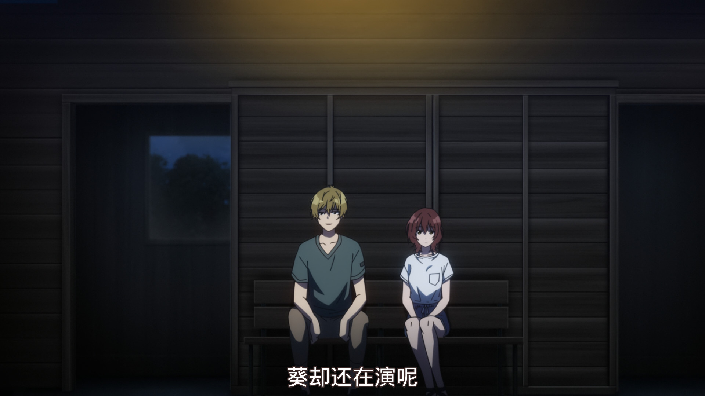

> 为什么现在我都已经说出真心话了 葵却还在演 wwwwwww

- 目标KPI

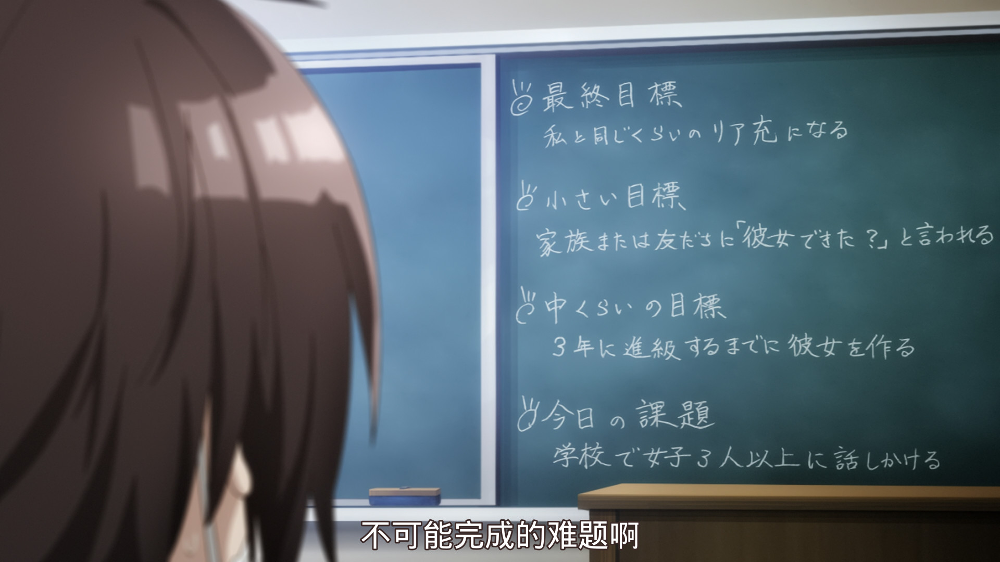

- 硬核脱宅

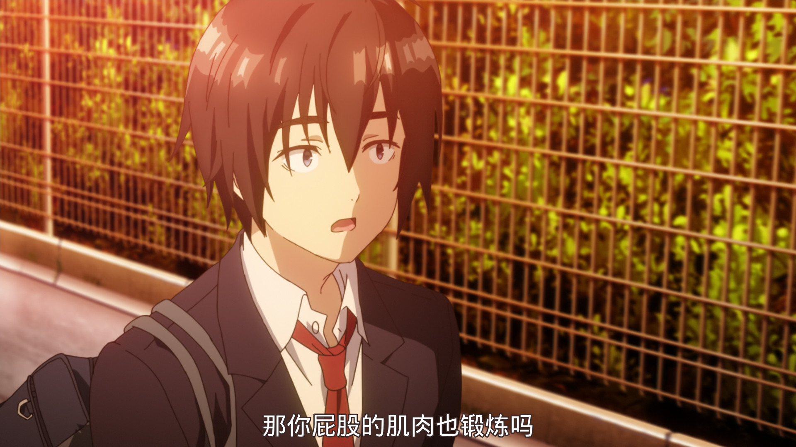

- no game no life

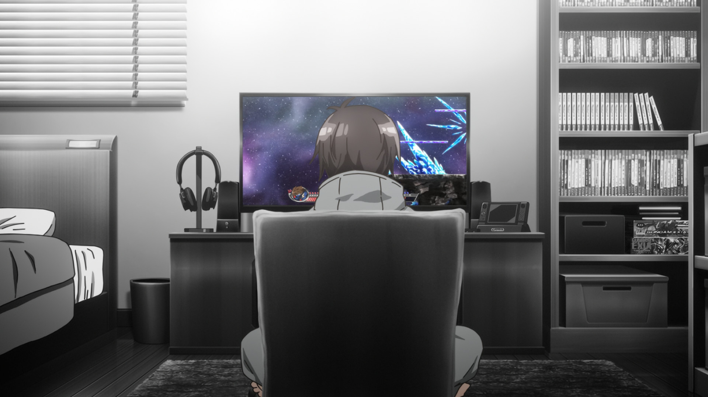

而氷菓的要素则更广为人知：

- 好奇宝宝

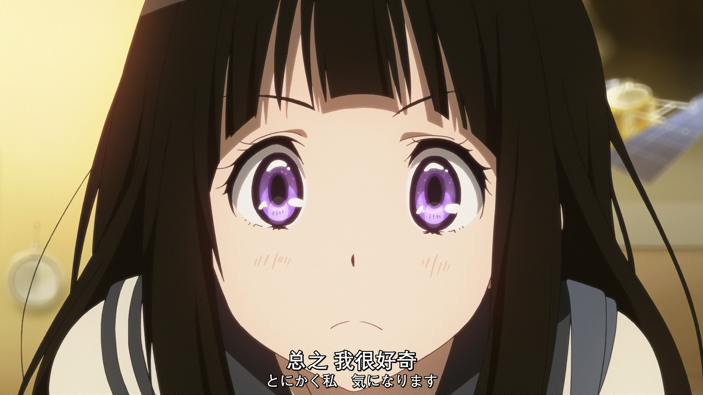

- 节能主义

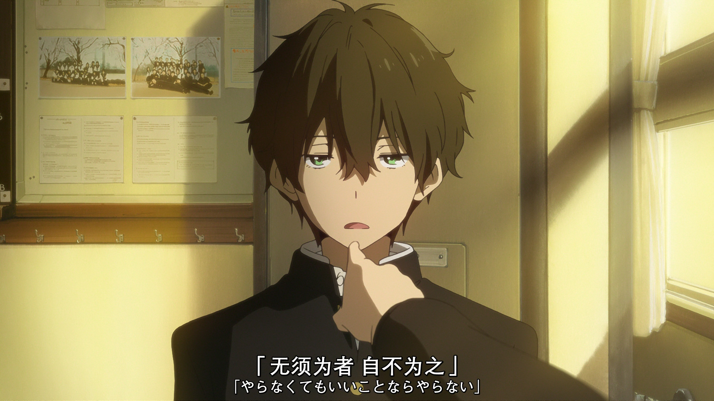

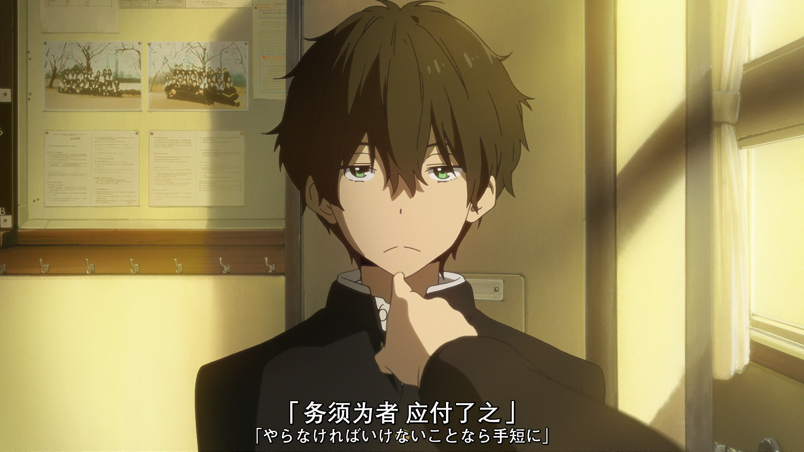

- 总是被姐姐算计的折木

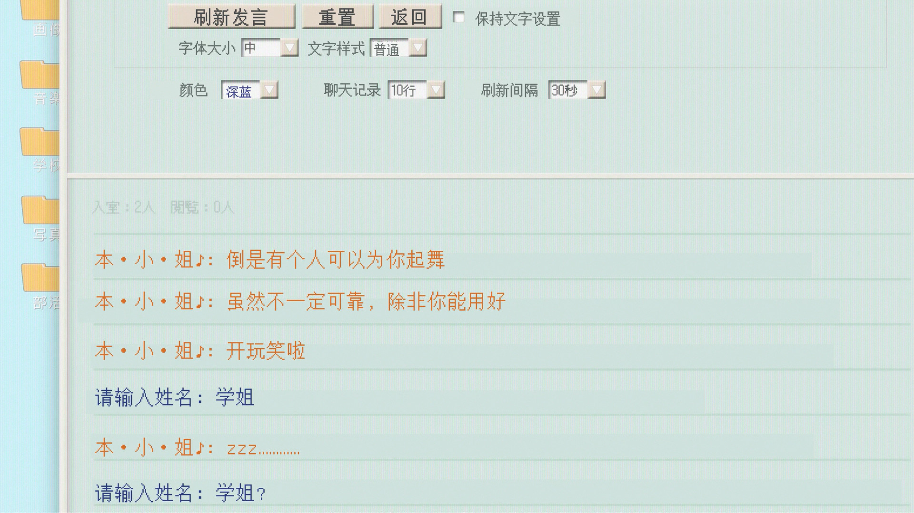

- 多重谜题

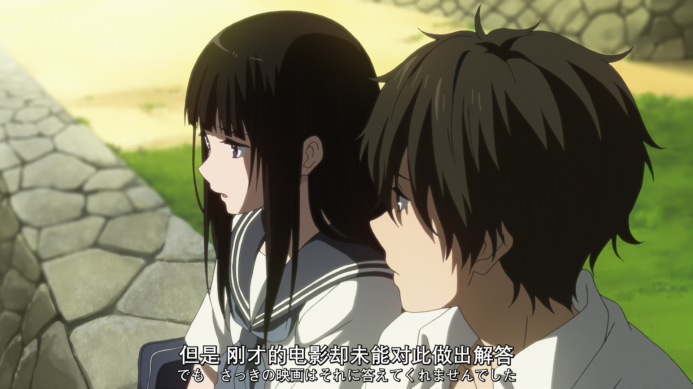

> 其实，在笔者看来，无论是《万人的死角》，《库特利亚芙卡的顺序》还是《绕远路的雛（hina）》。均是有好几层故事在里面的。

估计很多人听说过氷菓，但没怎么听过弱角友崎。不管怎么样，还是先用我的语言来概述一下剧情吧。

## Top2带Top1游戏大佬攻略人生游戏的故事

弱角友崎的主要剧情确实用一句来概括的话，就是这样。

更具体地说的话，就是：几乎无论在哪个方面都能做到第一的日南葵(女主)，结果在一部Neta任天堂大乱斗的游戏里，怎么都拿不到全服第一，总是位居老二。同时，也慢慢地开始尊敬起了Top1的玩家。在一次和Top1的对战之后，提出线下面基的邀请。见面之后，才发现对方竟是不起眼且邋遢的同班同学友崎（男主）。不仅如此，还发觉出对方身上对人生游戏的鄙夷态度。于是乎，因为无法忍受自己尊敬的游戏Top1现实里竟然是如此这般颓废的样子，发誓要让男主改变对人生的态度，让他也认同人生是个神级游戏（神ゲー）。

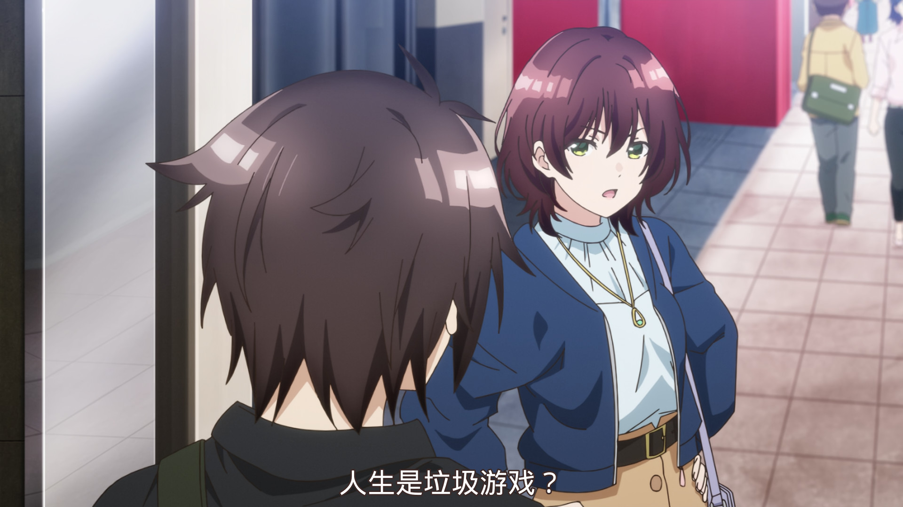

随后，便开始了针对女主设下目标的攻略活动。被传授各种各样的技巧，现充圈子里的潜规则。（嘛，对于现充来说可能太小儿科了，但对我这种内向宅宅来说，还是大开眼界了的说。）

> 最终目标：成为和我差不多等级的现充
>
> 小目标：被家人或朋友问“有女朋友了？”（的程度）
>
> 中目标：升高三之前，交上女朋友。
>
> 今日课题：在学校和三个以上的女学生搭话。

最后，被灌输了太多套路和技巧的男主，受某个表白事件的影响（当然不是男主啦），开始质疑这样做的正当性。决定去做自己本心认同的事，而不是单纯去完成女主设下的目标。在"任务"完事之后，和女主坦白了自己的想法。当然，最后还是意识到自己非但没有反对女主对自己的“现充养成”，还乐享其成的份上，主动和女主和好了。并约好了要女主继续他的现充养成计划。

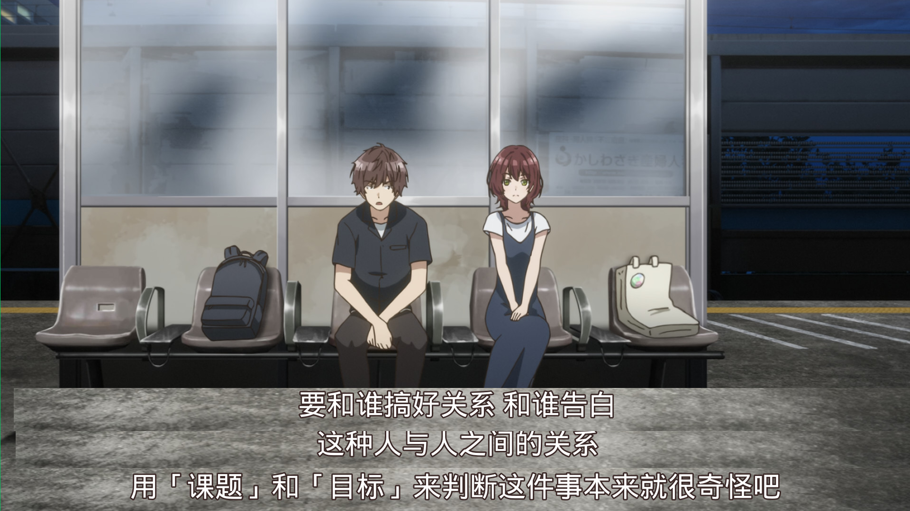

以上便是弱角第一季的基本剧情。上升到人生层面多半有点假大空，而且我也没到可以谈人生感悟的年龄吧。不如换个我更擅长的话题，谈谈对游戏的感受。在我看来，按照游戏的根本目的来分，只有两种玩家：单纯为了赢和单纯为了快乐的玩家。单纯为了赢，玩家可以做出很多很强迫症，也许也会被认为很硬核的事情：查攻略甚至自己写攻略，所有任务所有剧情都按照最优路线去做，追求全收集全成就。就拿原神来说的话，那些一开新图就尽快开完全图，开完宝箱和神之眼之类的，就属于这种吧。而另一批玩家，或许更在乎游戏本身所带来的乐趣。或者探索剧情，就算不是最优路线也罢;或者召集亲朋好友，做一些沙雕的活动，整一下博人一笑的狠活。我自认为自己就属于后者吧。在以前打PUBG的时候，我就很喜欢“乱”玩：比如什么把摩托车开上楼顶，在平地架DP-28扫车什么的。俗称《逗川玩家》。也不免经常被朋友喷。哈哈:) 毕竟，游戏的最初目的，不就是为了快乐吗？怎么开心就怎么来。**在纯粹的快乐面前，什么技巧，都无所谓了。**

## 好奇宝宝与节能侦探

基本剧情：略（都这么有名了，基本剧情就不用我说了吧）

首先，笔者并不是推理小说资深读者，相反还苦手得很。所以，对动画化剧情中的所有谜题，均没有猜出来！！！当然，这也并不影响欣赏它的剧情。

用很多人说过的话来说，冰菓就是“日常推理”的典范。《万人的死角》篇章，似乎就有点对自身这个题材自嘲的意味？因为不会死人，所以在剧情的刺激上就不如其他推理题材的小说。但也正因为如此，本作在其哲学性，社会性上，做了很多的思考，埋了很多精心构思的内容在里面，耐人寻味。就如同我在开篇所说的：

>  其实，在笔者看来，无论是《万人的死角》，《库特利亚芙卡的顺序》还是《绕远路的雛（hina）》。均是有好几层故事在里面的。

万人的死角，是谁的死角？电影剧情？班上的人？亦或是主角团的？

库特利亚芙卡的顺序，是怎么制定的？其中，被偷走的又是什么呢？

绕远路的雛，是人偶，是女主，还是那不得不委婉表达的心意？

......

随着读者（观众）慢慢深入思考，便会自己领悟到剧情背后的深意。

而很多人诟病的女主“好奇宝宝”问题，其实也在结尾的时候，有好好交代出原因。理所当然地，也有让人印象深刻的经典表白：

> > 「見てください、折木さん。ここがわたしの場所です。どうです、水と土しかありません。人々もだんだん老い疲れてきています。山々は整然と植林されていますが、商品価値としてはどうでしょう？わたしはここを最高に美しいとは思いません。可能性に満ちているとも思っていません。でも…」
> > 腕を下ろし、ついでに目も伏せて、千反田は呟いた。
> > 「折木さんに、紹介したかったんです」
>
> 角川文庫『遠まわりする雛』pp.406-407 来源：https://note.com/vast_hyssop759/n/na165c1dc0ba2
>
> 译文：
>
> 「折木同学，请看！这是我的归宿。怎样呢？除了水和土地什么也没有。人们也渐渐老去。山上整齐地种植着树木，但它们的经济价值又如何呢？我并不认为这里是最美的地方。也不会认为这里充满着机会。但是。。。」
>
> 千代田垂下手臂，接着也低下视线，低声说道。
>
> 「我想向折木同学介绍这里。」

（很想全文背诵的说）

关于细节的分析，我想我就没必要献丑了。毕竟，很多我也是看别人的解析才理解的，现有的解析在这方面写得比我要好得多。而我更多谈谈自己的感悟，也有对比弱角的感想。到底是直奔主题类型的爱情展开好，还是「月が綺麗ですね」的日式古典恋情展开更胜一筹？见仁见智吧。相比起仅仅局限于校园生活的弱角，冰菓背后的命题显得更为沉重：不够强的话，可是连悲鸣都发不出来，僵尸般行尸走肉地活着; 天才只是稍微努力，仅凭一时兴趣，便创造出凡人所望尘莫及的惊世名作，而后不再感兴趣便封笔，让名作成为绝唱，无视世人的期待，仅留人感慨实力的差距与天才的任性......之类的。（折木他们的青春过得真苦涩啊，看看隔壁弱角......）

另一方面来说，日常推理或许也在引导我们勤于思考，从日常小事中发现一些不同寻常的细节。仔细从身边挖掘题材的话，说不定会有不小发现。本身，主角团所做的，也不过是在解决日常发生的事件。而解决事件的结果，除了表面上的解决问题，也说不定会伴随着挖掘出尘封已久的故事，或者其他的一些收获。父母的故事，爷爷奶奶的故事，家乡的故事，亦或是母校的故事。**无论有没有人在观察记录，在任何角落，故事都是在进行着的。区别也只不过是，记录在历史上，或是成为时间里的一粒尘埃罢了。**

## 后记

嘛，写到这里，我才发现，把他们拿过来一起说，也只是因为当时先后连着看的，外加两者在恋爱题材上的倾向是两种极端。实在要说的话，冰菓还是具有压倒性的优势。~~（我才不会说我看弱角的原因是みみみ的单马尾和它那个很好听的ED呢！！！）~~ 但弱角又或许站在现充的角度，在给我们这种死宅科普一下我们未曾经历过的另一种青春的模样呢？让我推荐的话，我觉得我也没必要推荐。就如同其名，喜欢古典的，自然会去看古典部系列的《冰菓》; 而在意自己是强角还是弱角的，亦或是喜欢炒股党争的话，就去看弱角好了。
