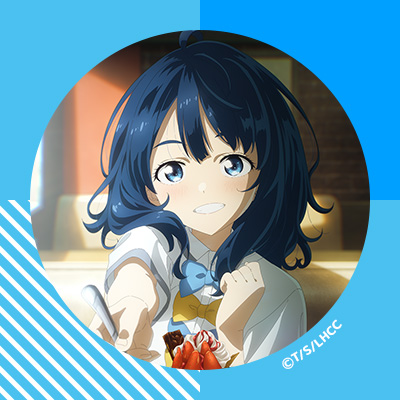

It was a year with no major events, yet at the same time, it was filled with a series of small changes that, in hindsight, might just be turning points.

## Taking Over and Maintaining the Droidian Port, and Getting the Hang of It

As early as the end of 2023, I knew there was a Droidian port for my Xperia 5 II. However, it was my only daily driver at the time, so I couldn't unlock the bootloader and flash it. It wasn't until later, when I couldn't resist and splurged on an Xperia 1 V, that this device was finally free to be tinkered with.

I ran into a ton of difficulties at the beginning. The first hurdle was just flashing it, and even then, it would fail to boot. Luckily, I was in a group chat with the original maintainer, PeterCXY, so I contacted him and learned that it required a specific version of Android to run. The package he had built was for Android 11. The current and final Android version for the Xperia 5 II is actually 12, so I had to downgrade it first. After finally getting it flashed and booted, I discovered that many of its packages were so far behind upstream that I had no SIM support, the external display had screen tearing, and the device would randomly reboot. On top of that, Droidian was undergoing a major version change, so updating the packages would just crash the desktop environment. To fix this, I had to learn how to SSH into the phone via USB and configure routing tables on my PC to forward the network connection, just to get it online (because there was no suitable command-line TUI to configure Wi-Fi, the only way was through Network over USB cable. Quite a workaround.)

To solve the issues of being behind upstream and having the wrong major version, I had no choice but to take over the related projects and set up my own rootfs build pipeline. Then came the painful process of reading the official Droidian Porting Guide and studying the project code left by PeterCXY. Fortunately, through trial and error, I slowly figured out the entire porting project and successfully took it over. I even added my own required packages and set up my own software repository on top of the existing project. After all that, and updating the underlying libraries (kernel and Mesa), the SIM card and secondary display issues were finally resolved.

## Worst Film of the Year

I've decided to start a "Worst of the Year" category, and first up is the worst film.

Yes, it's you, Master Miyazaki's "The Boy and the Heron" (君たちはどう生きるか).
Pure self-expression, filled with overly abstract metaphors and imagery.

The fact that it won an Academy Award is a total disgrace; it deserves to be nailed to a pillar of shame. Perhaps it was just a consolation prize for a revered, elderly master in his twilight years. In reality, the film doesn't deserve any awards; it's merely a depiction of Miyazaki's personal feelings. The narrative is fragmented—one moment he's looking for his mother, the next an old man is stacking blocks. The only thing my friend who watched it with me remembers is the line, "The Navy idiots said Saipan could hold for half a year, how did it fall in a month?" As for me, I can probably only remember the cute, chubby white creatures.

Just as I was scrolling through countless apologetic, over-intellectualized reviews, I came across an interpretation that suddenly made everything click.

> **This ending can be interpreted as Miyazaki shattering the Ghibli kingdom, calling on future creators to innovate rather than follow his old path. It also urges the audience, who have long been immersed in it, to step out of the pure and beautiful 2D world and face reality.**
>
> The main point is that a master cannot and should not be worshipped as a god forever, nor can he always accompany and protect us. We have to rely on ourselves for the days to come.
>
> From this perspective, I seem to have found a tiny reason (or excuse) for why *The Boy and the Heron* was made to be so "bad."
>
> Was this not intentional?!
>
> — "Miyazaki's Worst! But a Must-See! A Spoiler-Free Guide to 'The Boy and the Heron'," by Geye Ye Hen Zhai, https://zhuanlan.zhihu.com/p/690635783

## Best Film of the Year

*Titanic*. Any objections? Of course, I didn't watch that many movies in 2024, so it was the only one that really stood out. As some have said, if you watch it for the first time or just superficially, you might think it's just a love story. But when you think about it carefully, you realize it's not just a simple romance, but also a documentary depicting the heroine's life and capturing the culture and historical context of that era. For a more detailed review, please see [Some Thoughts on Titanic](https://archiemeng.github.io/zh-cn/p/对泰坦尼克的一些感想/).

## Best Documentary of the Year

For me, it's a tie between *The Lisbon Maru* and *Power On: The Story of Xbox*.
 
The story behind the first film's creation is quite extraordinary.

> In 2014, producer Fang Li and director Han Han were filming "The Continent" on Dongji Island when they happened to hear from local fishermen about a nearby WWII shipwreck. As a "tech guy" who graduated from the East China Institute of Geology (now East China University of Technology) with a degree in Applied Geophysics, and having worked in the development and manufacturing of geophysical and marine survey equipment before entering the film industry, Fang Li's curiosity was piqued. He subsequently led a marine technology team to begin survey work in 2016. — "Interview | 'The Lisbon Maru' Director Fang Li: I Seized a Piece of History," The Paper, by Wang Zheng.

The incident was so awkward that all four involved nations—China, the US, the UK, and Japan—were reluctant to publicize it.

- **Japan:** The Japanese government at the time flatly denied its atrocities, claiming that Allied forces had sunk a Japanese ship and that the Japanese military had rescued several hundred people, calling the atrocity claims "fabrications." The incident exposed the Japanese military's severe violation of international law and abuse of prisoners of war, which is why Japan is unwilling to mention it.
- **UK:** The fact that British soldiers were captured by the Japanese in Hong Kong was embarrassing in itself. Furthermore, these British POWs were being transported when their ship was sunk by an American submarine—an ally—resulting in massive casualties. This left the UK with "no real presence" in the event and in an awkward position.
- **USA:** The US submarine USS Grouper mistakenly sank the Lisbon Maru, which was carrying Allied POWs, causing significant friendly casualties. For the US, this was an inglorious "friendly fire" incident, so they were also reluctant to discuss it.
- **China:** Although Chinese fishermen bravely rescued Allied POWs, demonstrating great humanitarian spirit, the rescued British soldiers were the same colonialists who had previously occupied Hong Kong. This makes the event complex and awkward from certain perspectives.

The film includes interviews with individuals from all four countries. Many segments are quite moving. For example, the son of one victim only learned how his father died when the film's production and interviews began. A crew member from the submarine that sank the Lisbon Maru is still filled with remorse for the friendly fire incident, even though the ultimate fault did not lie with the US military. If you're curious about this story, I highly recommend watching it.

I think the second film is an essential resource for understanding how the youngest of the "big three" of console gaming got its start.

If Nintendo's rise was built on filling the void left by the Atari crash, coupled with the exceptional gameplay and groundbreaking concepts of its first-party titles; and if Sony's rise was born from Nintendo's betrayal, leveraging the then-leading capacity of CDs and adopting a third-party-friendly publishing policy that poached from Nintendo's camp to enrich its game library; then Microsoft's rise was fueled by its corporate DNA of being proactive and forward-thinking. The company felt a strong sense of threat and unease from Sony's PS2, a strategic centerpiece for home entertainment that posed a risk to its own Windows PC business. This led to the launch of a console platform that was the first to feature a hard drive and an excellent online gaming service.

This film, told from the perspective of those who were part of the Xbox project at Microsoft, details the internal and external environment in which the Xbox was conceived (internally, it faced a strong competitor in Windows CE, which was already being used as the OS for the Dreamcast). It chronicles the process of prototype design, internal competition, project approval, R&D, and launch, ultimately showing how it evolved into the powerhouse that stands among the big three today.

## Best Book of the Year

Last year, I mentioned the concept of a "life script" from the book *Transactional Analysis*, which is about "how a person lives their life and how they use their time." This book, *Make Time Your Friend*, describes some of the methods recommended by Li Xiaolai for using time. The core idea is how to leverage the compound effect of time to achieve growth and reach life goals through continuous accumulation and progress.

(To be honest, I've forgotten most of the content and should probably reread it sometime. I remember feeling it was pretty good at the time.)

## Most Surprising Manga of the Year

While traveling in Japan and wondering what to buy as a souvenir, I stumbled upon this *Angel Beats!* doujinshi (fan-made manga). I searched every online manga store in Tokyo and finally found that a second-hand bookstore in Shibuya had it—and it was the very last copy. They even gave me a 30% discount, so I got it for 700 yen. As a die-hard *Angel Beats!* fan, I was ecstatic!

The original anime ends with an easter egg where the protagonist meets Kanade (aka Angel) in Shibuya. However, subsequent games and manga never depicted what happened after the protagonist and Kanade left the afterlife. This manga does exactly that. The main story follows Angel as she travels across Japan in search of the "him" from her dreams (the protagonist, Otonashi Yuzuru). Although the premise is about finding the protagonist, it cleverly connects the main characters from the afterlife in the real world, showing their current situations while depicting their interesting interactions with Angel. Honestly, seeing these tragic characters, who had so many regrets in their past lives, find fulfillment in the present world was incredibly heartwarming. For that reason alone, I absolutely love this manga.

## Best Illustration of the Year

I saw this illustration in November, right during the golden season for viewing ginkgo trees. Coincidentally, the science channel *Guigu Shuo* had just released a video about ginkgo trees. In short, it's the only surviving species in the Ginkgophyta division of gymnosperms. You could say it's a plant forgotten by death: its natural enemies, pathogens, and even its ancient pollinators have all disappeared or gone extinct through evolution. It was supposed to vanish along with its pollinators in the long history of plant evolution. But it was lucky enough to encounter humans.

> A girl in autumn/winter attire gazes intently at a ginkgo leaf. Bright sunlight illuminates the golden ginkgo grove, dyeing the entire area gold. I wonder if this girl has heard the story of the ginkgo tree. What is she thinking at this very moment? What thoughts does the ginkgo inspire in her? These musings are why I love this illustration.

Seeing this painting made me want to see the ginkgo trees for myself. So, not long after, I acted on the impulse and went to Jiefang Park to see them.

## Best Anime of the Year

Exquisite production, a passionate output from the staff at A-1 Pictures, and an excellent original story all came together to create this standout romantic comedy of 2024.

You can enjoy the gluttonous Yanami, who is usually carefree but occasionally tender like a sea otter; you can see Lemon, who is emotionally dense, afraid to take initiative, and ultimately loses her crush to a newcomer; or you can watch the timid little animal Komari, curled up and stuttering. They each have their own stories, and the key element that makes up these stories is the youth I left behind in my own teenage years.

The scene that moved me the most was the one on the legendary "champion's bench." Of course, the anime adapted it, so they weren't actually sitting on a bench, but that didn't diminish its charm for me. The scene goes something like this:

When Kazuhiko Nukumizu, out of good intentions, offers to take the nervous Komari's place for a presentation, it unexpectedly leads to an argument, causing Komari to run off in tears. Nukumizu is left standing alone, overwhelmed by guilt and helplessness.

At that moment, Anna Yanami quietly walks up to his side. There are no extra words, no forced comfort. She just stands there, giving him an undisturbed space to calm down and process his feelings. By the time Nukumizu comes to his senses, he finds her right there, keeping him company.

This moment perfectly embodies my ideal of "presence is the most enduring confession of love." It's not about grand vows, but about offering the deepest understanding and support when someone is at their most vulnerable. This silent empathy is the warmest and most healing core of *Makeine: Too Many Losing Heroines!*.

## Best Music of the Year

 

The first ending theme of the Best Anime of the Year also smoothly takes the title of Best Music of the Year. *Clap, clap* 👏

It's a perfectly timed insert song at the end of each episode, feeling completely natural. The music video is also crafted with great care, telling the story of the protagonist, Nukumizu, buying light novels and searching for the girl on the cover. It's a well-made MV that never gets old, no matter how many times you watch it.

The lyrics are also filled with the heartfelt words of a pure-hearted young man.

> Where does love come from?
>
> 愛はどこからやってくるのでしょう？
>
> I asked my own heart
>
> 自分の胸に問いかけた
>
> I have no interest in fakes
>
> ニセモノなんか興味はないの
>
> I only want to see what's real
>
> ホントだけを見つめたい
>
> .....
>
> Even if I lie about my age
>
> サバよんでみたって
>
> I can't go back to those days
>
> あの頃に戻れやしないし
>
> So I want to accept the now
>
> だから今を認めていたいの
>
> Even if the most important things
>
> とても大切な事も
>
> Pass me by without notice
>
> 見過ごしちゃったとしても
>
> I'll just find them again
>
> また見つければイイ

Personally, I feel that the cover version by Yanami's voice actress, Hikaru Tono, has a more youthful feel and surpasses the original by hitomi. Of course, this might just be a first-impression bias since I heard the *Makeine* version first.

## Best Game of the Year

Despite a rocky launch and the emergence of the classic "Wuthering Waves formula" meme ("Character A only needs XXXX, but Character B has to consider so much more..."), the subsequent updates, with their new story quests, character development, and performance optimizations, showed Kuro Games' sincerity. The storylines in Mt. Firmament and the Black Shores, in particular, were a truly memorable chapter in the history of gacha games. It reminded me of the feeling I had when I first started playing *Genshin Impact*—a feeling I couldn't quite find again in its later versions. To use a phrase from the game, it helped me find "the meaning of my drifting."

The game's story and mini-game designs also clearly show inspiration and homage to classic works. Take the Shoreward Man quest in the Black Shores, for example. The mini-game is obviously inspired by *Portal*, with identical object-phasing logic. The main plot and presentation of the Shoreward Man character are clearly modeled after figures like Rei Ayanami from *Evangelion*. It's evident that the game designers have played these classic games and are familiar with these iconic works.
