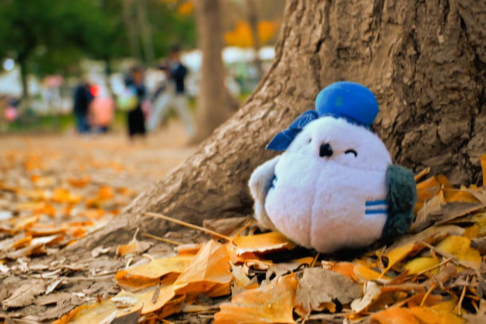
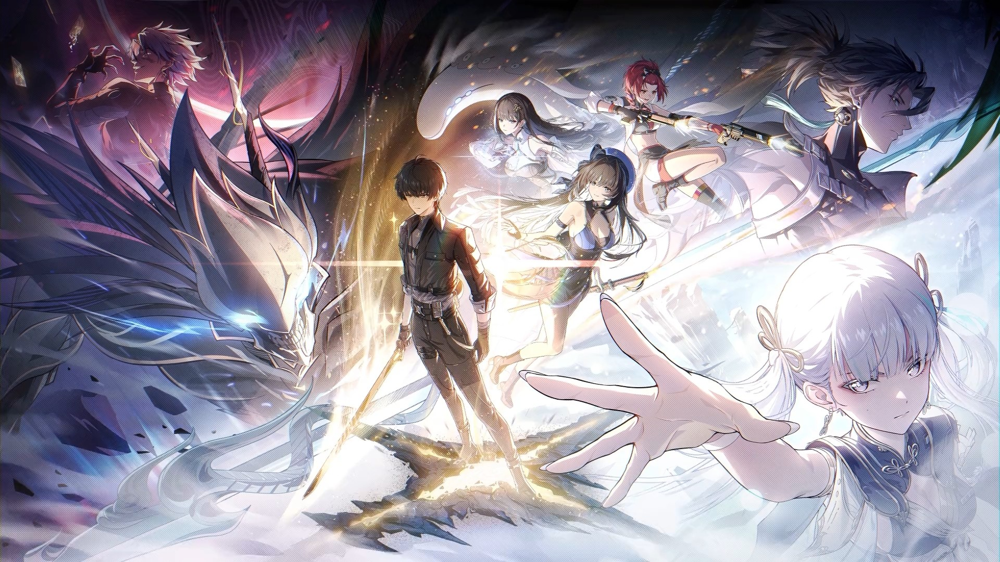

没有发生什么大事的一年，又同时是发生了一系列未来回看时，或许会成为转折点的小变化。
## 接手 Droidian 移植项目继续维护，渐入佳境
早在2023年底，我就知道了手上的 Xperia 5 II 有 Droidian 移植了。只不过，当时它是我的唯一主力机，所以没办法解锁刷机。直到后面，我忍不住剁手下单换了Xperia 1 V，这台机器才终于**空了出来，**可以用于刷机了。

开始的时候，也遇到了很多很多的困难。首先就是给它刷进去，还会有 boot 不进去的事情。还好我和原维护者 PeterCXY 在一个群里，直接摇他一问才知道，它需要特定的 Android 版本才能跑起来。而他打包的是对应 Android 11的。Xperia 5 II 当前同时也是最终的 Android 版本其实是12，我还得降级才能用。好不容易刷进去，能启动进去之后，我又发现现在它很多包的版本是如此落后上游，以至于出现了没有SIM支持，扩展屏显示画面撕裂以及时不时重启的问题。另一方面，还遇到了Droidian 大版本更替的问题，以至于一滚包桌面就挂掉了。为此，还不得不学会了 USB ssh 连接手机，通过电脑配置路由表，将网络转发给手机，才让它得以联网（因为没有合适的命令行 tui 来配置无线网络，只能通过Network over USB cable 的方式了。也是挺绕的。）

为了解决落后上游，以及当前刷机包大版本不对的问题，我不得不接手它的相关项目，并配置自己的 rootfs 构建流程。之后，便是痛苦的阅读 Droidian 官方的移植指南（Porting Guide）, 以及看 PeterCXY 留下的项目代码的过程。很幸运的是，一步步地踩坑的同时，慢慢地把整个移植项目给弄懂并接了下来。还在已有项目的基础上，增加自己需要的包和搭建自己的软件仓库。做完这些，更新完底层库（内核和 Mesa ），SIM卡的问题和副屏显示都顺利地解决了。

## 年度最烂电影
决定今年开始可以评选年度最烂的分类了。首先是就是这个最烂电影。

没错，就是你，宫老爷的「你想活出怎样的一生」（君たちはどう生きるか）
完全的自我表达，过于抽象的隐喻和意象。

居然奥斯卡金像奖还颁给它了，真的是奇耻大辱，可以钉在耻辱柱上都不为过。也许，这只是送给垂暮之年、德高望重长者的安慰奖罢了。实际这个影片完全拿不了任何奖项，只是在描述宫老的个人情感罢了。叙事支离破碎，一会在找妈妈，一会老人开始叠塔。我一起去观影的朋友全片唯一能记住的情节只有“海军马鹿说塞班岛能守半年的，怎么一个月就没了啊？”。而我，大概只能记住里面的白白胖胖的萌萌小动物。

正当我看着无数“自有大儒为我辩经”式的过度解读影评时，我忽然看到了这样一种解释，忽然就茅塞顿开了。

> **这个结局可以被解读成：宫崎骏将吉卜力王国打碎，呼吁后来的创作者开拓创新而不是沿着自己的旧路走，还有还有，让一直以来沉浸其中的观众们从纯粹美好的二次元世界中走出来并直面真实。**
>
> 主打一个大师不可能也不应该永远被当做神来朝拜，以及不可能永远陪伴和呵护着我们，未来的日子还得靠我们自己。
>
> 从这个角度来说，我似乎也找到了一丁点的关于《你想活出怎样的人生》会被拍烂的理由（借口）了。
>
> 这真不是故意为之吗？！
>
> ——《宫崎骏最烂！但不能不看！《你想活出怎样的人生》排雷》，隔夜也很宅，https://zhuanlan.zhihu.com/p/690635783

## 年度最佳电影

泰坦尼克，有争议吗？当然，我2024看的电影好像也不是太多，也就它能打一些。和一些人说的一样，看之前或者第一遍粗浅地看的话，会以为这只是一部爱情片。而当你仔细思考之后，会觉得它并非简简单单的一部爱情片，更是一部描绘女主角人生，以及那个时代的风土人情时代背景的纪录片。详细观后感请参考[对泰坦尼克的一些感想](https://archiemeng.github.io/zh-cn/p/对泰坦尼克的一些感想/)

## 年度最佳纪录片

《里斯本丸沉没》和《Power On: The Story of Xbox》 这两个对我来说可以并列。
 
第一部片可以说它的诞生非常奇特。

> 2014年，制片人方励和导演韩寒在东极岛拍摄电影《后会无期》，偶然听当地渔民说起附近有一艘二战沉船的故事。作为一名毕业于华东地质学院（现东华理工大学）应用地球物理专业的“理工男”，在进入电影圈之前又刚好是从事地球探测和海洋调查技术装备的系统集成、研发制造工作，方励出于好奇，随即率领海洋科技团队在2016年展开了勘测工作。——《专访｜《里斯本丸沉没》导演方励：我抢到了历史》，澎湃新闻，王诤

甚至，涉事的中美英日四国都感到尴尬，不愿意宣传。

- **日本：** 当年的日本政府矢口否认其暴行，声称盟军击沉了日本船只，日军救了几百人，并称“暴行是捏造的”。这起事件揭露了日军严重违反国际公法，虐待战俘的罪行，因此日本不愿提及。
- **英国：** 英国士兵在香港被日军俘虏，本身就存在尴尬。此外，这些英军战俘在被押运途中，被作为盟友的美国潜艇击沉，导致大量伤亡，这使得英国在事件中“毫无存在感”且处境尴尬。
- **美国：** 美军潜艇“鲈鱼”号误击了载有盟军战俘的“里斯本丸”号，导致盟友的重大伤亡，这对于美方而言是一个不光彩的“误伤”事件，因此也不愿多谈。
- **中国：** 尽管中国渔民英勇救援了盟军战俘，展现了人道主义精神，但被救的英军战俘是此前侵占香港的殖民者，这使得事件在某些视角下显得复杂和尴尬。

这部片子里，包含了中日英美四国相关人物的采访。不少片段还是挺让人潸然泪下的，比如，有遇难者的儿子，直到这部片开始筹拍采访的时候，才知道自己父亲是如何逝去的；当时击沉里斯本丸的潜艇的艇员，至今都在为误击友军而忏悔的事情，即便最根本的错不在美军。如果对这段故事感到好奇的话，还是很推荐去看看的。

第二部片我觉得对了解当今游戏主机御三家中，最年轻的那家是如何起家的，是个非常重要的资料。

如果说，御三家里任天堂的起家是靠填补了雅达利崩溃后的空白，以及他家第一方游戏卓越的游戏性和开创时代的游戏理解；索尼是由任天堂背刺而起，使用了当时容量极其领先的CD媒体介质，以及在游戏发行上采取了对第三方厂商极度友好的政策，挖了任天堂墙角丰富了游戏阵容；那么微软的起家则是靠公司基因里的“居安思危，主动出击”，产生了因索尼家庭娱乐中心战略重心的PS2引发的，对自家 Windows PC 业务构成冲击的强烈威胁感和不安，进而推出的首次搭载硬盘和优秀的在线游戏服务的主机平台。

本片从微软XBox项目当年的亲历者角度，介绍了XBox是在一个什么样的内外环境（内部当时还有已经供DreamCast用作操作系统的Window CE这一实力竞争对手），在怎么样的过程当中经历了原型设计，内部竞争，立项，研发，发布，最终发展成今天这个跻身御三家的存在。

## 年度最佳书籍

去年提到了《人生脚本》的“所谓人生脚本，就是一个人如何度过自己一生，如何利用时间的方式。”。而这本书，就是在描述李笑来推荐的一些，如何利用时间的方式。核心内容是，如何利用时间的复利效应，在不断积累和进步中实现成长，达成人生目标。

（其实，其内容我也差不多忘了，找个时间复读一下吧。当时感觉内容还好。）

## 年度最惊喜漫画

在日本旅行中，在想该买点什么回去时，偶然发现了这部Angel Beats 同人漫画。当时也是查遍了整个东京的漫画书网，最后查到在涩谷的一家二手书店有，且仅有最后一本。最后给我打了7折，700日元拿下了。本AB死忠粉大满足！

原作正片当中，最后结尾给了个主角在渋谷遇到奏（即天使）的彩蛋。而在后续游戏以及漫画在内的作品，都没有描述主角和奏离开死后世界之后的故事。而这部漫画则正是描述这段故事的。主要内容是天使为了寻找梦中印象里的他（即男主音无结弦），辗转日本各处旅行。尽管说是找男主，但它巧妙地在各地把原来死后世界里的主要人物，在现世串了起来，展现他们现状的同时，描写一下他们和天使之间的有趣互动。老实说，看到前世有着种种缺憾的可悲角色，在现世得到弥补了的感觉，还是很欣慰的。就冲着这点，我非常喜欢这部漫画。

## 年度最佳插画

看到这幅画的时候正值观赏银杏的黄金时期，11月。正好，那时候鬼谷说也更了一期科普银杏的视频。简而言之，它是裸子植物中，银杏门唯一幸存的一种植物。可以说，它是被死神遗忘了的植物：它的天敌，病原体，乃至以前的传粉动物，都在演化的过程中消失灭绝了。本来，它也将随着它传粉动物的灭绝而一同消失在漫长的植物演化史当中。可它很幸运地遇到了人类。

> 着秋冬穿搭的少女聚精会神地看着银杏树叶。明亮的阳光打在金黄色的银杏树林上，将整块区域染成金色。我在想，这位少女是否听说过银杏的故事，此时此刻的她，又在想些什么？看着银杏，她又萌生了哪些感想？而这些遐想，便是我喜欢这幅画的原因。

因为看到了这幅画，我不禁也萌生了去看看银杏的想法。于是，当时没过多久，就说做就做，去解放公园看银杏去了。

## 年度最佳番剧

精良的制作，A-1 Pictures 的工作人员们厨力拉满的输出，优秀的原作剧情文本，共同造就了这样一部2024年的恋爱喜剧霸权番。

你既可以欣赏暴食的，平时大大咧咧，却又时而温情的八奈见暴食海獭；也可以看到感情迟钝，不敢主动推进关系，最后喜欢的人被后来者抢先一步的柠檬；又或者看看蜷缩在一团，结结巴巴的害羞的小鞠小动物。她们各有各的故事，而构成这些故事的重要要素，便是我已经停留在少年时期的青春。

其中，最感动我的剧情是传说中的“冠军长椅”的那段。当然，动画有做改编，并没有坐长椅上。但这也不太影响我感受它的魅力。这段剧情大体是这样的：

当温水和彦出于好意，想代替紧张的小鞠上台报告，却意外引发争吵导致小鞠哭着跑开时，温水独自留在原地，被内疚和无力感淹没。

就在这时，八奈见杏菜静静地走到了他的身边，没有一句多余的台词，没有强行的安慰。她只是站在那里，给予温水一个可以独自平复心情、不被打扰的个人空间。而当温水回过神来时，已然发现，她就在他身边陪伴着他。

这一刻，完美诠释了我心中“陪伴是最长情的告白”这一爱情理想。它不是轰轰烈烈的誓言，而是在对方最脆弱时，给予最深切的理解和支持。这种不动声色的体谅，正是《败犬女主太多了！》这部作品最温暖、最治愈人心的内核。

## 年度最佳音乐
 

年度最佳番剧的ED1也顺利地拿下了年度最佳音乐。鼓掌鼓掌👏

每一次，在结尾毫无违和感地神插入，很自然。MV的制作也很用心。讲述的是男主温水采购轻小说，寻找封面的女主的故事。是个无论看过多少遍，都不会感到腻的，制作精良的MV.

歌词里，也尽是些纯情少年的肺腑之言。

> 爱究竟从何而来呢？
>
> 愛はどこからやってくるのでしょう？
>
> 向自己的内心如此问询着
>
> 自分の胸に問いかけた
>
> 我对虚情假意毫无兴趣
>
> ニセモノなんか興味はないの
>
> 只愿能够寻得真心
>
> ホントだけを見つめたい
>
> .....
>
> 就算把自己年龄说轻
>
> サバよんでみたって
>
> 那段日子也再回不去
>
> あの頃に戻れやしないし
>
> 所以想要认可当下啊
>
> だから今を認めていたいの
>
> 即便最为重要的事情
>
> とても大切な事も
>
> 就算与之擦肩而过
>
> 見過ごしちゃったとしても
>
> 那再去找到就好了
>
> また見つければイイ

而个人私心，这个由老八的声优遠野ひかる翻唱的版本，更有青春感，比原唱的hitomi版本更胜一筹。当然，也可能是因为先听的败犬女主的版本而导致的，先入为主的喜爱吧。

## 年度最佳游戏

尽管开服不利，还爆出了经典的鸣潮公式“A只需要XXXX就可以了，而B要考虑的事情就多了。”，但后面鸣潮版本更新带来的新剧情，人物塑造，性能优化等体现了库洛官方的诚意。特别是乘宵山和黑海岸的剧情，堪称二游史上浓墨重彩的一笔。让我想起了当初玩《原神》开荒时的那种感动，一种在后续版本中再难寻觅的感觉。用游戏里的话来说，它给我找到了“漂泊的意义”。

游戏剧情和小游戏设计里也可以轻易地看出对名作的借鉴和致敬。重点拿黑海岸守岸人的剧情来说，小游戏明显借鉴了传送门，所有的物品穿透逻辑一模一样。而守岸人剧情主线和演出，则是明显将守岸人作为类似《EVA》中的绫波丽来刻画的。可以看出，游戏策划对这些经典游戏和作品有着深刻的理解。
